# SLR Concept: Machine Learning-Based Financial Anomaly Detection for Anti-Corruption in Public Financial Governance Systems

> **Paper Type**: Systematic Literature Review (SLR)
> **Domain**: Information Systems — Public Sector IS, Anti-Corruption IS, Computational Governance
> **Target Output**: Peer-reviewed SLR paper (pre-requisite knowledge base for Phase 1 primary study)
> **Positioning Note**: This SLR treats the primary empirical study (Jambi Province anomaly detection pipeline) as **not yet published**. All reviewed literature is drawn exclusively from prior work. This document maps the scholarly landscape this SLR aims to synthesize.
> **Last Updated**: April 2026

---

## 1. Research Questions

The SLR constructs three focused research questions that collectively map (1) the *method landscape*, (2) the *operationalization gap*, and (3) the *contextual applicability boundary* of the reviewed body of knowledge.

---

### RQ1 — Method Landscape

> **"What computational methods and IS-grounded theoretical frameworks have been applied to detect financial anomalies indicative of corruption in government expenditure systems, and what do empirical outcomes reveal about their comparative effectiveness?"**

**Scope boundary**: Studies must address government/public sector financial data (not solely corporate or banking fraud). Methods include supervised, unsupervised, and hybrid machine learning; rule-based systems; and audit analytics approaches. IS-theoretical frameworks include any organizational or sociotechnical lens applied to situate the computational intervention.

**Rationale**: No existing SLR consolidates the IS-framed literature on ML-based anti-corruption detection specifically for public expenditure data. This RQ constructs the method-level map that the primary study builds upon.

---

### RQ2 — Operationalization of Corruption Modus Operandi

> **"How have existing studies operationalized corruption typologies and modus operandi — particularly in decentralized government fund distribution — as computationally detectable feature signals, and which feature engineering approaches demonstrate empirical validity?"**

**Scope boundary**: Studies that translate corruption behavioral patterns (mark-up, fictitious projects, procurement irregularities, fund diversion) into quantifiable variables, engineered features, or detection rules. Includes judicial verdict analyses, audit report mining, and feature-level explainability studies.

**Rationale**: The translation from corruption *behavior* to computational *signal* is the least systematically documented step in the literature. This RQ surfaces what has been tried, validated, and what remains untested.

---

### RQ3 — Gaps and Applicability Boundaries

> **"What methodological, contextual, and theoretical gaps in the current IS and data science literature prevent the development of scalable, near-real-time corruption detection systems applicable to village-level financial governance in developing countries?"**

**Scope boundary**: Gap analysis focused on: (a) absence of developing-country village/sub-national fiscal system coverage; (b) label scarcity in real-world anti-corruption detection datasets; (c) lack of IS-theoretically grounded evaluation criteria; (d) detection lag problems not addressed by current approaches.

**Rationale**: This RQ directly motivates the primary study by establishing what the SLR cannot answer — the precise scholarly vacuum the empirical research fills.

---

## 2. IS SLR Foundation: Gregor-Hevner Knowledge Contribution Framework

### 2.1 Positioning the SLR within Design Science Research

Hevner, March, Park, and Ram [H1] established Design Science Research (DSR) in IS as a paradigm grounded in three cycles: the **Relevance Cycle** (connecting real-world problems to research), the **Design Cycle** (iterative artifact development), and the **Rigor Cycle** (connecting research to the scholarly knowledge base). An SLR contributes primarily to the **Rigor Cycle**: it systematically audits the knowledge base to determine what theories, methods, and findings already exist — and what gaps they leave unfilled — before a new design artifact is developed.

Gregor and Hevner [H2] extended DSR epistemology with the **Knowledge Contribution Framework**, which classifies IS research contributions along two axes: the *maturity of the problem* (nascent vs. well-understood) and the *maturity of the solution* (novel vs. known). This yields four contribution archetypes:

| Quadrant | Problem Maturity | Solution Maturity | Contribution Type |
|---|---|---|---|
| **Invention** | Nascent / new | Novel | Highest novelty — new theory or artifact for new problem |
| **Improvement** | Well-understood | Novel / better | Advances existing solution for known problem |
| **Exaptation** | Nascent / new | Known in other domain | Applies existing method to new, underexplored context |
| **Routine Design** | Well-understood | Known | Incremental — standard application of established methods |

### 2.2 Positioning This SLR

This SLR occupies the **Exaptation** quadrant. The problem domain — IS-mediated anti-corruption monitoring for village-level decentralized fiscal systems in developing countries — is nascent in IS literature: no prior SLR has systematically reviewed computational detection methods specifically for this governance context. The solution method — a Systematic Literature Review — is well-established, but its application to this specific IS problem space is novel and non-trivial.

```
Gregor-Hevner Positioning Map
──────────────────────────────────────────────────────────────────
                    SOLUTION MATURITY
                    Known             Novel
                 ┌─────────────────┬─────────────────┐
  PROBLEM     N  │   EXAPTATION    │   INVENTION     │
  MATURITY    a  │  ← THIS SLR    │                 │
              s  │                 │                 │
              c  ├─────────────────┼─────────────────┤
              e  │ ROUTINE DESIGN  │   IMPROVEMENT   │
              n  │                 │                 │
              t  │                 │                 │
                 └─────────────────┴─────────────────┘
```

### 2.3 IS-Specific SLR Methodology Anchor: Webster & Watson (2002)

Webster and Watson [H3] established the canonical IS-specific literature review methodology in MIS Quarterly. Their concept-centric approach — organizing the review around theoretical constructs rather than chronological or author-centric summaries — directly shapes this SLR's synthesis structure. The three organizing constructs for this SLR are:

1. **Detection Method** (the computational artifact): What algorithm, model, or system?
2. **IS Theoretical Frame** (the institutional anchor): What IS theory situates the artifact?
3. **Contextual Applicability** (the domain boundary): For what type of public financial system, at what governance level, in what country context?

### 2.4 IS Review Typology: Paré et al. (2015)

Paré, Trudel, Jaana, and Kitsiou [H4] classify IS literature reviews into seven types: narrative, descriptive, scoping, critical, meta-analytic, qualitative systematic, and umbrella. This SLR adopts a **qualitative systematic review with bibliometric augmentation** — the type that Paré et al. identify as appropriate when the body of knowledge is heterogeneous in method, context, and outcome measure, and when quantitative meta-analysis is not feasible due to non-comparable dependent variables across studies.

---

## 3. Research Framework Diagram

```mermaid
flowchart TD
    A([Problem Identification\nIS + Anti-Corruption\nin Decentralized\nPublic Finance]) --> B

    subgraph SCOPE["SCOPE DEFINITION (Gregor-Hevner Exaptation)"]
        B[Define SLR Boundary\nRQ1 · RQ2 · RQ3]
        B --> C[Identify Constructs\nDetection Method ·\nIS Theory · Context]
    end

    subgraph SEARCH["SEARCH STRATEGY (PRISMA 2020)"]
        C --> D[Database Selection\nScopus · IEEE Xplore · WoS\nOpenAlex · Semantic Scholar]
        D --> E[Query Construction\nBoolean + Field Tags\nTitle · Abstract · Keywords]
        E --> F[Initial Retrieval\nAll candidate records]
    end

    subgraph SCREENING["DUAL-STAGE SCREENING"]
        F --> G[Stage 1: Title + Abstract\nInclusion / Exclusion\nCriteria Applied]
        G --> H{Passes\nStage 1?}
        H -- No --> I[(Excluded Pool\nwith reason code)]
        H -- Yes --> J[Stage 2: Full-Text Review\nQuality Assessment\nPICOS Validation]
        J --> K{Quality\nScore ≥ Threshold?}
        K -- No --> I
        K -- Yes --> L[(Included Pool\nFinal Corpus)]
    end

    subgraph DOWNLOAD["PAPER ACQUISITION (Automated + Manual)"]
        L --> M[quality_filter_slr.py\nAuto-Download via\nOpenAlex · Unpaywall\nSemantic Scholar API]
        M --> N{Available\nOpen Access?}
        N -- Yes --> O[(papers-literatures/\nDownloaded PDFs)]
        N -- No --> P[(manual_download_log.txt\nWith DOI + Reason)]
    end

    subgraph EXTRACTION["DATA EXTRACTION & CODIFICATION"]
        O --> Q[Structured Coding\nCoding Scheme v1.0\nTwo Independent Coders]
        P --> Q
        Q --> R[Inter-Rater Reliability\nCohen's Kappa ≥ 0.70]
        R --> S[(coded_corpus.csv\nVariable-Level Dataset)]
    end

    subgraph SYNTHESIS["SYNTHESIS LAYER"]
        S --> T1[Quantitative Strand\nBibliometric Analysis\nCo-citation · Co-keyword\nVOSviewer / Bibliometrix]
        S --> T2[Qualitative Strand\nThematic Synthesis\nFramework Synthesis\nNarrative Synthesis]
        T1 --> U[Integrated Synthesis\nConceptual Map +\nEvidence Table]
        T2 --> U
    end

    subgraph REPORTING["REPORTING (PRISMA 2020 Compliant)"]
        U --> V[Answer RQ1 · RQ2 · RQ3]
        V --> W[Gap Matrix\nMethodological +\nContextual + Theoretical]
        W --> X([SLR Paper Output\n+ Future Research Agenda])
        W --> Y([Feeds Rigor Cycle\nfor Primary Study\nPhase 1])
    end

    style SCOPE fill:#e8f4f8,stroke:#2196F3
    style SEARCH fill:#e8f8e8,stroke:#4CAF50
    style SCREENING fill:#fff8e1,stroke:#FF9800
    style DOWNLOAD fill:#fce4ec,stroke:#E91E63
    style EXTRACTION fill:#f3e5f5,stroke:#9C27B0
    style SYNTHESIS fill:#e0f2f1,stroke:#009688
    style REPORTING fill:#e8eaf6,stroke:#3F51B5
```



---

## 4. Quality Assessment and Inclusion / Exclusion Criteria

### 4.1 PICOS Framework

| Dimension | Definition for This SLR |
|---|---|
| **P** — Population | Government / public sector financial systems; village-level, sub-national, or national fiscal data |
| **I** — Intervention | ML-based, rule-based, or hybrid computational methods for anomaly/fraud detection |
| **C** — Comparison | Comparative evaluation of ≥2 methods, or baseline vs. proposed method, or pre/post intervention |
| **O** — Outcome | Detection accuracy, precision/recall, anomaly score quality, audit actionability, or IS success metrics |
| **S** — Study type | Empirical (quantitative/qualitative/mixed), SLR, meta-analysis; peer-reviewed journal or top-tier conference |

### 4.2 Inclusion Criteria

| ID | Criterion |
|---|---|
| IC-01 | Published in a peer-reviewed, Scopus/ISI/IEEE-indexed outlet |
| IC-02 | Publication year: 2010–2026 (foundational pre-2010 papers treated separately as theoretical anchors) |
| IC-03 | Addresses financial anomaly detection, fraud detection, or corruption indicator identification |
| IC-04 | Applies computational method (ML, statistical, rule-based) to financial data |
| IC-05 | Full text available (OA or institutional) or abstract sufficient for Stage 1 screening |
| IC-06 | Written in English; OR Bahasa Indonesia papers with full English abstract and English key findings/conclusions section present — included to capture KPK audit reports, BPKP institutional analyses, and Indonesian academic journals not available in full English translation |

### 4.3 Exclusion Criteria

| ID | Criterion | Reason |
|---|---|---|
| EC-01 | Focuses exclusively on private-sector banking/credit card fraud (no public sector element) | Out of domain scope |
| EC-02 | Legal/forensic analysis without computational method | Method scope |
| EC-03 | Conference proceedings from non-indexed venues (not Scopus/IEEE/ACM) | Quality threshold |
| EC-04 | Duplicate records (same study in multiple databases) | De-duplication |
| EC-05 | Purely theoretical without empirical validation or case application | Lacks outcome evidence |
| EC-06 | Predatory journals (listed on Beall's List or Cabells Blacklist) | Integrity |

### 4.4 Quality Scoring Schema

Each paper in the included corpus receives a quality score (0–10) computed from five sub-dimensions. The composite scoring design follows Kitchenham and Brereton's [Q2] empirically validated criterion set for systematic reviews in computing research, adapted for IS-domain heterogeneity as recommended by Okoli [Q6] and Siddaway et al. [Q4]. Each dimension receives a weight that reflects its relative importance to the epistemological goals of this SLR: rigor of knowledge production (journal quality + methodological rigor = 50% combined) is weighted highest, followed by problem-relevance alignment (20%), and contextual modifiers — temporal currency and scholarly influence — at 30% combined.

| Dimension | Weight | Scoring Rubric | Theoretical Basis |
|---|---|---|---|
| **Journal/Venue Quality** | 25% | *Journals*: SJR Q1=10, Q2=7, Q3=5, Q4=3. *Conferences*: CORE A*=10, CORE A=7, CORE B=5, CORE C/Unranked=2 | Journals scored by SJR quartile [Q1]; conferences by CORE ERA ranking — CORE A* IS conferences (ICIS, ECIS, PACIS) carry prestige equivalent to Q1 journals and must not be conflated with Q4 journal proceedings [Q7] |
| **Methodological Rigor** | 25% | Reproducible method + validation = 10; validation only = 7; no validation = 3 | Kitchenham & Brereton [Q2] identify reproducibility and empirical validation as the primary quality discriminators in computing and IS SLRs |
| **Relevance to RQ** | 20% | Addresses all three RQ dimensions = 10; two = 7; one = 4 | Rowe [Q3] and Webster & Watson [H3] establish RQ coverage as the central IS-specific quality criterion — a paper must speak to the construct map, not merely share a domain label |
| **Recency** | 15% | 2022–2026 = 10; 2018–2021 = 7; 2014–2017 = 5; ≤2013 = 3 | Siddaway et al. [Q4] demonstrate that temporal scope directly determines a review's capacity to represent the current state of evidence; older papers are retained as theoretical anchors but weighted lower |
| **Citation Impact** | 15% | Top quartile by year-normalized citations = 10; second quartile = 7; lower = 4 | Raw citation counts are systematically biased toward older papers; Waltman et al. [Q5] establish mean normalized citation score (MNCS) as the correct year-adjusted influence metric |

**Threshold**: Papers scoring ≥ 6.0 proceed to full-text extraction. Papers scoring 4.0–5.9 enter a "borderline review" pool for adjudication by the second coder. The 6.0 threshold corresponds to the "moderate quality" floor that Kitchenham and Brereton [Q2] operationalize as the minimum acceptable evidence standard for inclusion in computing SLRs.

### 4.5 Theoretical Anchor Eligibility Criteria (Pre-2010 Papers)

Papers published before 2010 are excluded from the main corpus under IC-02 but may qualify as **Theoretical Anchors** — foundational works cited as conceptual grounding rather than primary evidence. Eligibility requires all three of the following conditions:

| Criterion | Operationalization |
|---|---|
| **Citation mass** | ≥ 300 total citations in Scopus or OpenAlex at the time of review (April 2026) |
| **Post-2020 active citation** | Cited in ≥ 3 peer-reviewed papers published 2020–2026, confirming ongoing disciplinary relevance |
| **Fundamental theoretical claim** | Paper makes an original theoretical claim that remains a live construct in IS or adjacent disciplines — not merely a historically important empirical study |

Papers meeting all three criteria are tagged `anchor = TRUE` in `coded_corpus.csv` and cited in the theoretical framework sections of the SLR paper. They are **not included in bibliometric cluster analyses** to avoid inflating centrality of older works relative to contemporary evidence.

### 4.6 Sensitivity Analysis Plan

To demonstrate robustness of the inclusion threshold, a sensitivity analysis will be reported as an appendix in the final SLR paper:

| Scenario | Threshold | Purpose |
|---|---|---|
| **Primary analysis** | ≥ 6.0 | Main included corpus — all synthesis conducted on this set |
| **Sensitivity lower bound** | ≥ 5.5 | Reports how many borderline papers enter corpus and whether thematic synthesis conclusions change |
| **Sensitivity upper bound** | ≥ 6.5 | Reports how many papers are excluded and whether any thematic cluster loses critical mass |

**Reporting format**: A three-row comparison table in the appendix showing corpus size N, number of themes affected, and direction of change in key findings (stable / partially changed / substantially changed) across all three thresholds. Stable conclusions across all three thresholds strengthen the robustness claim of the SLR.

### 4.7 Stage 1 Screening IRR Protocol

Inter-rater reliability applies to **both** Stage 1 (title + abstract screening) and Stage 2 (full-text quality scoring). Since a co-author is available, the following dual-coder protocol applies:

**Stage 1 — Full Independent Screening:**
1. Both Coder 1 (primary researcher) and Coder 2 (co-author) independently screen 100% of Stage 1 records against IC/EC criteria, recording binary decisions (Include / Exclude) with a reason code from the EC-01–EC-06 taxonomy
2. Cohen's Kappa (κ) computed on full Stage 1 set — target: **κ ≥ 0.75** (stricter than coding stage, as binary decisions carry less interpretive nuance)
3. Disagreements resolved via consensus discussion; persistent disagreements referred to a third-party adjudicator

**Stage 2 — Quality Score Calibration:**
1. Both coders independently score a random 20% pilot sample (estimated 8–16 papers given target corpus of 40–80)
2. Per-dimension κ computed; dimensions falling below 0.70 trigger revision of the coding guide before full corpus scoring
3. Remaining 80% assigned to Coder 1, with Coder 2 reviewing all borderline papers (4.0–5.4 range)

**Stage 0 — Domain-Relevance Override Protocol (pre-IRR, April 2026 addition)**:

Cross-check of the 52 manually retrieved PDFs in `SLR/papers/` against pipeline outputs revealed a **systematic scoring bias** against developing-country IS journals. Specifically, all village fund governance and Indonesian anti-corruption papers received composite scores of 4.15 — not because of low methodological quality, but because:
- `score_journal_quality` defaults to 2.0/10 for unranked Indonesian/small journals
- `score_citation_impact` is depressed (recent papers, 2023–2026, citations ≤ 20)
- `score_methodological_rigor` assigns 3.0 for quantitative survey designs (not ML-experimental)

These papers are, however, the **primary evidence base for RQ2** (corruption typology operationalization in village-level fiscal systems) and **RQ3** (developing-country applicability gaps) — the very domains that establish this SLR's novelty. Excluding them on journal-tier grounds would produce a corpus systematically blind to its own domain of inquiry.

**Override protocol**:
1. The `crosscheck_papers.py` script identifies all BORDERLINE papers with HIGH or MEDIUM domain relevance to RQ2/RQ3 — yielding **27 priority-review papers** (12 HIGH, 15 MEDIUM)
2. Coder 1 reads the abstract of each priority-review paper against three criteria:
   - Does the paper address village fund / Dana Desa / Indonesian decentralized fiscal governance? → `DOMAIN_OVERRIDE_RQ2`
   - Does the paper address applicability gaps, contextual barriers, or developing-country IS implementation challenges? → `DOMAIN_OVERRIDE_RQ3`
   - Does the paper use data-driven or IS-theoretic methods for corruption / fraud detection in government expenditure? → `DOMAIN_OVERRIDE_RQ1_RQ2`
3. Papers meeting ANY criterion → quality_score manually set to 6.0 in `coded_corpus.csv`; override rationale recorded in `adjudication_note` column
4. Papers meeting NO criterion → retain pipeline score; exclude if below 5.5

**Precedent**: Petticrew & Roberts (2006, *Systematic Reviews in the Social Sciences*) explicitly advocate purposive sampling supplementary to systematic search when evidence bases in novel domain niches are structurally thin — a condition directly applicable here given the documented absence of prior SLRs on this specific topic (confirmed in scoping run: 0 SLRs on village-level IS corruption detection).

**Expected corpus size**: 40–80 papers in final included set based on preliminary domain density estimate.

---

## 5. Script Concept: `quality_filter_slr.py`

### 5.1 Architecture Overview

The script extends the existing `download_papers.py` infrastructure with a three-stage pipeline: **Filter → Score → Acquire**. It accepts a structured paper metadata input (CSV or JSONL), applies inclusion/exclusion logic, computes quality scores, attempts multi-source OA downloads, and writes a manual download log for inaccessible papers.

```
INPUT                   STAGE 1              STAGE 2              STAGE 3
─────────────────────   ──────────────────   ─────────────────   ─────────────────────
papers_raw.csv      →   Inclusion/Exclusion  Quality Scoring  →  Acquire OA PDF
(DOI, title, year,      Filter              (0–10 weighted       ├─ OpenAlex API
 journal, abstract,     ├─ IC-01 to IC-06    composite)          ├─ Unpaywall API
 citation_count,        └─ EC-01 to EC-06    ├─ Score ≥ 6.0 →   ├─ Semantic Scholar
 source_db)                                      included          ├─ Direct OA URL
                                             ├─ 4.0–5.9 →        └─ arXiv normalise
                                                 borderline
                                             └─ < 4.0 →
                                                 excluded
OUTPUT FILES
─────────────────────────────────────────────────────────────────────────────────────
papers-literatures/          → Downloaded PDFs (validated ≥ 8 KB, %PDF header)
slr_included_corpus.csv      → Final included papers with quality scores
slr_excluded_log.csv         → Excluded papers with reason code
manual_download_log.txt      → Papers that passed quality filter but OA unavailable
slr_borderline.csv           → Papers flagged for human adjudication
```

### 5.2 Pseudocode Logic

```python
"""
quality_filter_slr.py — SLR Quality Filter + Acquisition Pipeline
==================================================================
Stage 1:  Load paper metadata → apply IC/EC filters → produce candidate pool
Stage 2:  Score each candidate on 5 quality dimensions → split into
          included / borderline / excluded
Stage 3:  For each included paper:
            attempt OA download via OpenAlex → Unpaywall → Semantic Scholar
            → direct URL (if available in metadata)
          if download fails → write to manual_download_log.txt with DOI,
          title, source_url_tried, and reason (paywall / 404 / no OA version)
          else → validate PDF (%PDF magic bytes, size ≥ 8KB) → save to
          papers-literatures/
Outputs:  slr_included_corpus.csv, slr_excluded_log.csv,
          manual_download_log.txt, slr_borderline.csv
"""

# ── Dependencies ──────────────────────────────────────────────────────────────
# pip install requests pandas tqdm

import pandas as pd
import requests
import time
from pathlib import Path

# ── Configuration ─────────────────────────────────────────────────────────────
YEAR_MIN        = 2010
YEAR_MAX        = 2026
QUALITY_INCLUDE = 6.0      # threshold: paper enters included corpus
QUALITY_BORDER  = 4.0      # threshold: paper enters borderline review
MIN_PDF_BYTES   = 8_000
DELAY_SEC       = 2        # polite delay between API calls
OUTPUT_DIR      = Path("papers-literatures")
OUTPUT_DIR.mkdir(exist_ok=True)

# ── STAGE 1: Inclusion / Exclusion Filters ────────────────────────────────────
EXCLUSION_RULES = {
    "EC-01": lambda row: is_private_sector_only(row),      # no public sector
    "EC-02": lambda row: is_legal_no_computation(row),     # no ML/stats method
    "EC-03": lambda row: is_non_indexed_conference(row),   # not Scopus/IEEE
    "EC-04": lambda row: row["is_duplicate"],              # de-duplication flag
    "EC-05": lambda row: is_purely_theoretical(row),       # no empirical output
    "EC-06": lambda row: is_predatory_journal(row),        # Beall/Cabells list
}

def apply_filters(df: pd.DataFrame) -> tuple[pd.DataFrame, pd.DataFrame]:
    """Return (candidates, excluded_with_reason)."""
    excluded_rows = []
    candidate_rows = []
    for _, row in df.iterrows():
        exclusion_reason = None
        for rule_id, rule_fn in EXCLUSION_RULES.items():
            if rule_fn(row):
                exclusion_reason = rule_id
                break
        if exclusion_reason:
            row["exclusion_reason"] = exclusion_reason
            excluded_rows.append(row)
        else:
            candidate_rows.append(row)
    return pd.DataFrame(candidate_rows), pd.DataFrame(excluded_rows)

# ── STAGE 2: Quality Scoring ──────────────────────────────────────────────────
def compute_quality_score(row: pd.Series) -> float:
    """Weighted composite quality score 0–10."""
    scores = {
        "journal_quality":     score_journal_rank(row.get("sjr_quartile", "Q4")),
        "methodological_rigor":score_methodology(row.get("has_validation", False)),
        "relevance_to_rq":     score_relevance(row.get("rq_coverage", 0)),
        "recency":             score_recency(int(row.get("year", 2010))),
        "citation_impact":     score_citations(row.get("citations_per_year", 0)),
    }
    weights = {
        "journal_quality": 0.25,
        "methodological_rigor": 0.25,
        "relevance_to_rq": 0.20,
        "recency": 0.15,
        "citation_impact": 0.15,
    }
    return sum(scores[k] * weights[k] for k in scores)

# ── STAGE 3: OA Acquisition ───────────────────────────────────────────────────
OA_SOURCES = [
    acquire_from_openalex,       # OpenAlex /works?doi={doi} → oa_url
    acquire_from_unpaywall,      # api.unpaywall.org/{doi}?email=...
    acquire_from_semantic_scholar, # api.semanticscholar.org/graph/v1/paper/{doi}
    acquire_from_direct_url,     # row["oa_url"] if present in metadata
]

def acquire_paper(row: pd.Series) -> tuple[bool, str]:
    """
    Try each OA source in order. Return (success, reason_if_failed).
    On success: saves validated PDF to OUTPUT_DIR.
    On failure: returns reason string for manual_download_log.
    """
    doi   = row.get("doi", "")
    title = row.get("title", "unknown")[:60]
    for acquire_fn in OA_SOURCES:
        success, pdf_bytes_or_reason = acquire_fn(doi, row)
        if success:
            path = OUTPUT_DIR / sanitize_filename(f"{title}.pdf")
            path.write_bytes(pdf_bytes_or_reason)
            return True, ""
        time.sleep(DELAY_SEC)
    return False, "No open-access version found via OpenAlex/Unpaywall/S2/DirectURL"

def write_manual_log(manual_list: list[dict], path: Path) -> None:
    """
    Write a human-readable manual download note file.
    Each entry includes: title, DOI, publisher URL, reason, and action instruction.
    """
    with path.open("w", encoding="utf-8") as f:
        f.write("# Manual Download Required\n")
        f.write("# These papers passed quality filtering but have no open-access version.\n")
        f.write("# Please download manually and place in papers-literatures/\n\n")
        for i, entry in enumerate(manual_list, 1):
            f.write(f"[{i}] {entry['title']}\n")
            f.write(f"    DOI       : {entry['doi']}\n")
            f.write(f"    Publisher : https://doi.org/{entry['doi']}\n")
            f.write(f"    Reason    : {entry['reason']}\n\n")
```

### 5.3 Input File Format

The script expects `papers_raw.csv` with the following columns:

| Column | Type | Description |
|---|---|---|
| `doi` | str | DOI (required) |
| `title` | str | Full paper title |
| `year` | int | Publication year |
| `journal` | str | Journal or conference name |
| `sjr_quartile` | str | Q1/Q2/Q3/Q4 or blank |
| `citations` | int | Total citation count (from OpenAlex/Scopus) |
| `source_db` | str | Database of origin (scopus, ieee, openalex, etc.) |
| `oa_url` | str | Known OA PDF URL if available (can be blank) |
| `abstract` | str | Abstract text for keyword screening |
| `is_duplicate` | bool | True if already identified as duplicate |

---

## 6. Methodology: Quantitative and Qualitative Synthesis Approaches

### 6.1 Overview of Adopted Hybrid Methodology

This SLR adopts a **mixed synthesis design** combining bibliometric analysis (quantitative strand) with thematic and framework synthesis (qualitative strand). The two strands operate on the same included corpus and converge at the integrated synthesis stage — a design that Templier and Paré [M1] validate as producing higher explanatory depth than single-strand reviews in IS research.

### 6.2 Quantitative Strand — Bibliometric Analysis

**Purpose**: Map the intellectual structure of the field — who are the key authors, what are the dominant concepts, how has the literature evolved over time?

**Tools**: VOSviewer (co-citation and co-authorship networks) or Bibliometrix (R package — comprehensive bibliometric suite).

**Analyses performed**:

| Analysis Type | Method | Output |
|---|---|---|
| **Publication trend** | Annual count + field-normalized citation rate | Growth trajectory chart |
| **Co-citation analysis** | Pearson correlation of co-cited reference pairs | Intellectual cluster map |
| **Co-word / keyword co-occurrence** | Fractional counting, VOS layout | Thematic cluster diagram |
| **Author collaboration network** | Bibliographic coupling | Research group map |
| **Journal concentration** | Bradford's Law zone analysis | Core journal list |
| **Temporal keyword shift** | Overlay visualization | Concept evolution timeline |

### 6.3 Qualitative Strand — Three Synthesis Approaches

#### 6.3.1 Thematic Synthesis (Thomas & Harden, 2008) [M2]

Thematic synthesis proceeds through three stages: (1) line-by-line coding of findings from primary studies; (2) development of descriptive themes; (3) generation of analytical themes that go beyond primary study interpretations to produce new theoretical insight. Applied here to synthesize findings across heterogeneous methods and contexts into a coherent IS-theoretic narrative.

**Output**: A thematic map of how computational anti-corruption detection has been theorized and applied in IS literature.

#### 6.3.2 Framework Synthesis (Carroll et al., 2011) [M3]

Framework synthesis uses an *a priori* conceptual framework — in this case, the Hevner et al. (2004) DSR three-cycle model — to organize and code extracted data. Each reviewed study is mapped against the DSR framework: which cycle does it address (Relevance/Design/Rigor)? What IS artifact does it produce or evaluate? What gap in the knowledge base does it expose?

**Output**: A DSR-alignment matrix showing the distribution of existing studies across DSR cycles and identifying the Rigor Cycle gaps this SLR fills.

#### 6.3.3 Narrative Synthesis with Logic Model (Popay et al., 2006) [M4]

Narrative synthesis constructs a logic model — a causal chain from inputs (problem conditions) through mechanisms (detection methods) to outputs (IS outcomes) and contextual moderators (governance context, data availability, label scarcity). This approach is particularly valuable for surfacing *why* certain methods work in some governance contexts but not others.

**Output**: A logic model of computational anti-corruption detection as an IS intervention.

### 6.4 Codification Scheme

Each included paper is coded against the following structured scheme in `coded_corpus.csv`:

| Code Group | Variables |
|---|---|
| **Bibliographic** | `authors`, `year`, `journal`, `doi`, `sjr_quartile`, `citations` |
| **IS Theory Used** | `primary_theory` (DSR / D&M / TTF / PAT / Institutional / None), `theory_role` (foundational / evaluative / analogical) |
| **Detection Method** | `method_category` (unsupervised / supervised / hybrid / rule-based), `algorithm_name`, `feature_count`, `validated` (Y/N) |
| **Data Context** | `data_source_type` (government expenditure / procurement / tax / payroll), `country_income_level` (high / upper-mid / lower-mid / low), `governance_level` (national / sub-national / village) |
| **Corruption Typology** | `typology_addressed` (mark-up / fictitious / procurement / diversion / multiple), `typology_framework_cited` |
| **Outcome Metrics** | `primary_metric` (AUC / F1 / Precision / recall / expert validation), `reported_value` |
| **Gap Signals** | `gap_rq1`, `gap_rq2`, `gap_rq3` (free-text, coded during extraction) |

### 6.5 Inter-Rater Reliability

Two independent coders apply the coding scheme to a random 20% sample of the included corpus. Cohen's Kappa (κ) is computed for each nominal code variable. The target threshold is **κ ≥ 0.70** (substantial agreement per Landis & Koch, 1977). Variables falling below threshold are adjudicated via discussion and the coding guide is revised before applying to the full corpus.

### 6.6 High-Priority Methodology / Approach Recommendations

The following table ranks synthesis approaches by their expected contribution to **in-depth analysis** for this specific SLR topic, based on alignment with the heterogeneous literature landscape:

| Priority | Approach | Key Reference | Why High Priority for This SLR |
|---|---|---|---|
| ★★★★★ | **PRISMA 2020 + Bibliometrix Hybrid** | Page et al. [M5]; Aria & Cuccurullo [M6] | Provides both transparent reporting (PRISMA) and quantitative intellectual structure mapping. Best for a nascent, growing field. |
| ★★★★★ | **Framework Synthesis (DSR-aligned)** | Carroll et al. [M3]; Hevner et al. [H1] | Directly maps evidence to DSR Rigor Cycle gaps — the most theoretically coherent approach for IS design research SLR. |
| ★★★★☆ | **Thematic Synthesis** | Thomas & Harden [M2] | Generates analytical themes that transcend individual study findings. Essential for RQ3 gap analysis. |
| ★★★★☆ | **Structured Content Codification + Cohen's κ** | Landis & Koch, 1977 | Ensures replicability and auditability of qualitative claims — critical for SLR credibility. |
| ★★★☆☆ | **Narrative Synthesis with Logic Model** | Popay et al. [M4] | Best for surfacing contextual moderators (why methods fail in certain governance contexts). |
| ★★★☆☆ | **Co-citation Analysis (VOSviewer)** | Van Eck & Waltman [M7] | Identifies intellectual clusters and foundational works the SLR must engage with. |
| ★★☆☆☆ | **GRADE Evidence Profiling** | Guyatt et al. [M8] | Appropriate if included studies report comparable outcome metrics enabling cross-study rating. |
| ★★☆☆☆ | **Scoping Pre-Map (prior to full SLR)** | Arksey & O'Malley [M9] | Useful only as a pre-screening step to confirm sufficient literature density before committing to full SLR. |

---

## 7. Comparison Tables

### 7.1 SLR Synthesis Methodology Comparison

| Methodology | Epistemological Stance | Best Fit Condition | Key Strength | Key Limitation | Output Type |
|---|---|---|---|---|---|
| **PRISMA 2020 + Bibliometrics** | Positivist + Interpretivist | Heterogeneous methods, growing field, need for intellectual mapping | Transparent; dual-level (structural + content) insight | Requires large corpus (≥ 30 papers) for meaningful bibliometric clusters | Citation network + thematic synthesis |
| **Framework Synthesis** | Interpretivist | Strong a priori theory available; want to test theory applicability | Theoretically coherent; produces theory-aligned gap matrix | Risks forcing data into inappropriate framework categories | DSR/IS theory alignment matrix |
| **Thematic Synthesis** | Interpretivist | Heterogeneous study designs; no single dominant theory | Grounded in evidence; generates novel analytical categories | Labor-intensive; susceptible to researcher interpretive bias | Thematic map + analytical themes |
| **Narrative Synthesis (Logic Model)** | Interpretivist | Complex intervention with context-dependent outcomes | Explains *why* mechanisms work or fail | Less structured; harder to replicate | Logic model diagram + narrative |
| **Meta-Analysis** | Positivist | Homogeneous outcome metrics (e.g., AUC scores) across studies | Precise quantitative effect size estimates | Infeasible when methods/contexts are too heterogeneous | Forest plot + pooled effect size |
| **Scoping Review** | Positivist | Exploring boundary of an unfamiliar field | Fast; identifies literature density | No quality assessment; superficial synthesis | Coverage map |
| **GRADE Profiling** | Positivist | Multiple studies measuring same outcome | Standardized evidence quality rating | Requires comparable dependent variables | Evidence quality table |

### 7.2 Paper Database Source Comparison

| Database | Coverage Strength | IS Relevance | OA API Available | Search Capability | Best For |
|---|---|---|---|---|---|
| **Scopus** | Broad; largest abstract/citation DB | Strong (all IS journals indexed) | Scopus Search API (institutional key required) | Advanced Boolean, field tags, CiteScore filter | Comprehensive systematic searches |
| **IEEE Xplore** | CS/EE/IS; conference-heavy | High for computing methods papers | IEEE Xplore API | Full-text search, conference/journal filter | ML methods and computational papers |
| **Web of Science** | High-impact journals; citation analytics | Moderate | WoS API (institutional) | Highly refined, JIF filter | Bibliometric/citation analysis |
| **OpenAlex** | 250M+ works; fully open | Strong | Free REST API (no key) | DOI, title, abstract, citation graphs | Free-tier comprehensive retrieval |
| **Semantic Scholar** | 200M+ papers; AI-enriched | Strong for AI/ML papers | Free REST API | Semantic search, reference graph, PDF links | ML-heavy IS papers; PDF finding |
| **arXiv** | Preprints; CS/AI/ML/Econ | Moderate (preprints only) | arXiv API (free) | Category + keyword | Cutting-edge ML methods pre-publication |

### 7.3 Quality Assessment Framework Comparison

| Framework | Designed For | Dimensions Assessed | Scoring | Limitation for This SLR |
|---|---|---|---|---|
| **CASP (Critical Appraisal Skills Programme)** | Clinical/health research | Validity, results, relevance | Checklist (Y/N/Can't tell) | Not designed for IS or computational studies |
| **MMAT (Mixed Methods Appraisal Tool)** | Mixed-methods studies | Design-specific validity threats | 5-item checklist per study type | Covers mixed methods well; limited for pure ML papers |
| **JBI Critical Appraisal** | Systematic reviews | Methodology quality, reporting | Checklist-based | Healthcare-oriented; IS adaptation needed |
| **PRISMA-S (Search reporting)** | Systematic review search quality | Search comprehensiveness | 16-item checklist | Reports search quality only, not paper quality |
| **Custom PICOS Scoring (this SLR)** | IS computational research | Journal rank, method rigor, relevance, recency, citation impact | Weighted 0–10 composite | Requires calibration; subjective components in scoring |
| **GRADE** | Clinical evidence synthesis | Certainty of evidence | 4 levels (high/mod/low/very low) | Requires comparable outcome metrics; infeasible for heterogeneous IS studies |

### 7.4 OA Download Tool Comparison (for `quality_filter_slr.py`)

| Tool / API | Free Access | Scope | Success Rate (est.) | Key Limitation |
|---|---|---|---|---|
| **OpenAlex API** | Yes (no key) | 250M works; OA URL field | ~60–70% for recent IS papers | OA URL not always direct PDF; may link to landing page |
| **Unpaywall API** | Yes (email param) | Legal OA versions only | ~65–75% for journals 2015+ | Does not include preprints; institutional access not returned |
| **Semantic Scholar API** | Yes (no key) | 200M papers; `openAccessPdf` field | ~50–65% for AI/IS papers | PDF links sometimes broken or restricted |
| **CrossRef API** | Yes (no key) | DOI metadata only | N/A (no PDF) | Provides metadata and DOI resolution; no OA PDFs |
| **Direct OA URL (metadata)** | Depends | User-provided in metadata | 100% if URL valid | Requires pre-populated metadata from earlier search |
| **arXiv normalisation** | Yes | CS/AI/ML preprints | ~90% for arXiv-hosted papers | Only for papers with arXiv version |
| **Google Scholar (scraping)** | No (TOS violation) | Broad | High | Violates Terms of Service; not recommended |

### 7.5 IS Theoretical Framework Positioning Comparison

The following table maps candidate IS theories to their positioning within the Gregor-Hevner quadrant for this research program:

| IS Theory | Primary Claim | Role in This SLR | Role in Primary Study | Gregor-Hevner Fit |
|---|---|---|---|---|
| **Design Science Research (Hevner et al., 2004)** [H1] | IS research creates and evaluates artifacts; knowledge contribution grounded in Relevance + Rigor cycles | SLR framework anchor; positions SLR in Rigor Cycle | Phase 1 artifact (detection pipeline) positioned in Design Cycle | **Exaptation** — DSR method applied to anti-corruption IS domain |
| **DeLone & McLean IS Success Model (2003)** | IS system success measured by information quality → use → individual/organizational impact | Evaluative criterion for reviewed detection systems | Evaluation criterion for detection pipeline deployment | **Improvement** — updated D&M applied to anti-corruption context |
| **Principal-Agent Theory** | Information asymmetry between principal and agent enables opportunistic behavior | Theoretical lens for why monitoring IS is needed | Operationalizes anomaly = asymmetry exploitation signal | **Exaptation** — PAT applied to village-level public finance IS |
| **Fraud Triangle (Cressey, 1953)** | Fraud requires Pressure + Opportunity + Rationalization | Frames corruption typology classification in reviewed studies | Interpretive lens for anomaly typology mapping | **Exaptation** — criminological theory applied to IS detection context |
| **Institutional Theory (DiMaggio & Powell, 1983)** | Organizations adopt practices through coercive, mimetic, normative isomorphism | Explains why IS anti-corruption tools are (or are not) adopted | Secondary theory for governance adoption section | **Exaptation** — institutional IS adoption in public governance |
| **Task-Technology Fit (Goodhue & Thompson, 1995)** | Technology performance depends on fit between task requirements and tech capabilities | Assesses fit between audit task requirements and ML method capabilities | Frames method selection criteria | **Improvement** — TTF applied to IS-mediated audit analytics |

---

## 8. References (SLR Concept — Foundational Only)

> Note: Full reference list will be built in `09-references.md` as the SLR develops. Entries below are foundational anchors cited in this concept document. All DOIs are verified as valid.

### Design Science / IS Research Methodology
[H1] A. R. Hevner, S. T. March, J. Park, and S. Ram, "Design science in information systems research," *MIS Quarterly*, vol. 28, no. 1, pp. 75–105, 2004. DOI: [10.2307/25148625](https://doi.org/10.2307/25148625)

[H2] S. Gregor and A. R. Hevner, "Positioning and presenting design science research for maximum impact," *MIS Quarterly*, vol. 37, no. 2, pp. 337–355, 2013. DOI: [10.25300/MISQ/2013/37.2.01](https://doi.org/10.25300/MISQ/2013/37.2.01)

[H3] J. Webster and R. T. Watson, "Analyzing the past to prepare for the future: Writing a literature review," *MIS Quarterly*, vol. 26, no. 2, pp. xiii–xxiii, 2002. DOI: [10.2307/4132319](https://doi.org/10.2307/4132319)

[H4] G. Paré, M. C. Trudel, M. Jaana, and S. Kitsiou, "Synthesizing information systems knowledge: A typology of literature reviews," *Information & Management*, vol. 52, no. 2, pp. 183–199, 2015. DOI: [10.1016/j.im.2014.08.008](https://doi.org/10.1016/j.im.2014.08.008)

### Synthesis Methodology
[M1] M. Templier and G. Paré, "A framework for guiding and evaluating literature reviews," *Communications of the Association for Information Systems*, vol. 37, no. 6, pp. 112–137, 2015. DOI: [10.17705/1CAIS.03706](https://doi.org/10.17705/1CAIS.03706)

[M2] J. Thomas and A. Harden, "Methods for the thematic synthesis of qualitative research in systematic reviews," *BMC Medical Research Methodology*, vol. 8, no. 45, 2008. DOI: [10.1186/1471-2288-8-45](https://doi.org/10.1186/1471-2288-8-45)

[M3] C. Carroll, N. Booth, and J. Cooper, "A worked example of 'best fit' framework synthesis: A systematic review of views concerning the taking of some potential chemopreventive agents," *BMC Medical Research Methodology*, vol. 11, no. 29, 2011. DOI: [10.1186/1471-2288-11-29](https://doi.org/10.1186/1471-2288-11-29)

[M4] J. Popay et al., "Guidance on the conduct of narrative synthesis in systematic reviews," *ESRC Methods Programme*, Lancaster University, 2006. Available: [https://www.lancaster.ac.uk/media/lancaster-university/content-assets/documents/fhm/dhr/chir/NSsynthesisguidanceVersion1-April2006.pdf](https://www.lancaster.ac.uk/media/lancaster-university/content-assets/documents/fhm/dhr/chir/NSsynthesisguidanceVersion1-April2006.pdf)

[M5] M. J. Page et al., "The PRISMA 2020 statement: An updated guideline for reporting systematic reviews," *BMJ*, vol. 372, n71, 2021. DOI: [10.1136/bmj.n71](https://doi.org/10.1136/bmj.n71)

[M6] M. Aria and C. Cuccurullo, "bibliometrix: An R-tool for comprehensive science mapping analysis," *Journal of Informetrics*, vol. 11, no. 4, pp. 959–975, 2017. DOI: [10.1016/j.joi.2017.08.007](https://doi.org/10.1016/j.joi.2017.08.007)

[M7] N. J. Van Eck and L. Waltman, "Software survey: VOSviewer, a computer program for bibliometric mapping," *Scientometrics*, vol. 84, no. 2, pp. 523–538, 2010. DOI: [10.1007/s11192-009-0146-3](https://doi.org/10.1007/s11192-009-0146-3)

[M8] G. H. Guyatt et al., "GRADE: An emerging consensus on rating quality of evidence and strength of recommendations," *BMJ*, vol. 336, no. 7650, pp. 924–926, 2008. DOI: [10.1136/bmj.39489.470347.AD](https://doi.org/10.1136/bmj.39489.470347.AD)

[M9] H. Arksey and L. O'Malley, "Scoping studies: Towards a methodological framework," *International Journal of Social Research Methodology*, vol. 8, no. 1, pp. 19–32, 2005. DOI: [10.1080/1364557032000119616](https://doi.org/10.1080/1364557032000119616)

### Quality Assessment Methodology (Section 4.4 Citations)

[Q1] B. González-Pereira, V. P. Guerrero-Bote, and F. Moya-Anegón, "A new approach to the metric of journals' scientific prestige: The SJR indicator," *Journal of Informetrics*, vol. 4, no. 3, pp. 379–391, 2010. DOI: [10.1016/j.joi.2010.03.002](https://doi.org/10.1016/j.joi.2010.03.002)
- **Validates**: Journal/Venue Quality dimension (SJR quartile as proxy). SJR weights citations by the prestige of the citing journal rather than treating all citations equally, making it more robust than raw JIF for cross-domain IS quality assessment.
- **Scopus/Scimago indexed**: Yes — *Journal of Informetrics*, Q1.

[Q2] B. Kitchenham and P. Brereton, "A systematic review of systematic review process research in software engineering," *Information and Software Technology*, vol. 55, no. 12, pp. 2049–2075, 2013. DOI: [10.1016/j.infsof.2013.07.010](https://doi.org/10.1016/j.infsof.2013.07.010)
- **Validates**: Methodological Rigor dimension + overall quality threshold rationale. Kitchenham and Brereton systematically analyze 68 SLR studies and identify reproducibility, empirical validation, and protocol pre-registration as the primary discriminators of SLR quality in computing and IS research.
- **Scopus/Scimago indexed**: Yes — *Information and Software Technology*, Q1.

[Q3] F. Rowe, "What literature review is not: diversity, boundaries and recommendations," *European Journal of Information Systems*, vol. 23, no. 3, pp. 241–255, 2014. DOI: [10.1057/ejis.2014.7](https://doi.org/10.1057/ejis.2014.7)
- **Validates**: Relevance to RQ dimension. Rowe's IS-specific critique establishes that a literature review's primary quality criterion is the precision with which reviewed studies address the stated research questions — topical proximity alone is insufficient; construct-level alignment is required.
- **Scopus/Scimago indexed**: Yes — *European Journal of Information Systems*, Q1 (ABS 4).

[Q4] A. P. Siddaway, A. M. Wood, and L. V. Hedges, "How to do a systematic review: A best practice guide for conducting and reporting narrative reviews, meta-analyses, and meta-syntheses," *Annual Review of Psychology*, vol. 70, pp. 747–770, 2019. DOI: [10.1146/annurev-psych-010418-102803](https://doi.org/10.1146/annurev-psych-010418-102803)
- **Validates**: Recency dimension + composite scoring rationale. Siddaway et al. demonstrate that temporal scope directly determines a review's representativeness of current evidence, and recommend weighted composite quality scoring over binary inclusion/exclusion to preserve nuanced evidence gradations.
- **Scopus/Scimago indexed**: Yes — *Annual Review of Psychology*, Q1 (impact factor > 20).

[Q5] L. Waltman, N. J. van Eck, T. N. van Leeuwen, M. S. Visser, and A. F. J. van Raan, "Towards a new crown indicator: Some theoretical considerations," *Journal of Informetrics*, vol. 5, no. 1, pp. 37–47, 2011. DOI: [10.1016/j.joi.2010.08.001](https://doi.org/10.1016/j.joi.2010.08.001)
- **Validates**: Citation Impact dimension (year-normalized scoring). Waltman et al. formally demonstrate that raw citation counts are systematically biased in favor of older papers and establish the mean normalized citation score (MNCS) as the theoretically sound, year-adjusted influence measure — directly underpinning the quartile-based year-normalized scoring rubric used here.
- **Scopus/Scimago indexed**: Yes — *Journal of Informetrics*, Q1.

[Q6] C. Okoli, "A guide to conducting a standalone systematic literature review," *Communications of the Association for Information Systems*, vol. 37, no. 43, pp. 879–910, 2015. DOI: [10.17705/1CAIS.03743](https://doi.org/10.17705/1CAIS.03743)
- **Validates**: IS-specific adaptation of the composite quality scoring approach. Okoli provides the most operationally detailed IS-domain SLR methodology, explicitly recommending multi-criterion weighted quality assessment for IS research contexts where dependent variables and study designs are heterogeneous — precisely the condition this SLR faces.
- **Scopus/Scimago indexed**: Yes — *Communications of the Association for Information Systems*, Q2 (AIS flagship journal).

[Q7] CORE Computing Research and Education Association of Australasia, "CORE Conference Ranking Portal," 2023. Available: [https://www.core.edu.au/conference-portal](https://www.core.edu.au/conference-portal)
- **Validates**: Conference venue scoring in Section 4.4 (Journal/Venue Quality dimension). CORE provides the internationally recognised prestige ranking for computing and IS conference proceedings, maintained by the Computing Research and Education Association of Australasia and recognised by ERA (Excellence in Research for Australia). Used here to prevent systematic under-scoring of CORE A* IS conferences (ICIS, ECIS, PACIS) that would otherwise be conflated with low-tier Q4 journal proceedings.
- **Indexing note**: CORE is not a journal index but an industry-standard ranking body. Its conference rankings are cited as authoritative in IS research evaluation contexts.

### Foundational Theory Primary Sources

[T1] P. J. DiMaggio and W. W. Powell, "The iron cage revisited: Institutional isomorphism and collective rationality in organizations," *American Sociological Review*, vol. 48, no. 2, pp. 147–160, 1983. DOI: [10.2307/2095101](https://doi.org/10.2307/2095101)
- **Theory**: Institutional Theory (cited in Table 7.5). Establishes three isomorphic mechanisms — coercive, mimetic, normative — through which organizations converge on common structures and practices. Applied in this SLR to explain why IS anti-corruption tools are (or are not) adopted across governance levels.
- **Anchor status**: JSTOR-archived; DOI resolves to full text. Pre-digital article with ≥ 35,000 cross-domain citations and active citation post-2020 in IS adoption and public sector governance research — qualifies as Theoretical Anchor under Section 4.5 criteria (≥ 300 citations ✓; cited post-2020 ✓; fundamental theoretical claim ✓).

[T2] D. R. Cressey, *Other People's Money: A Study in the Social Psychology of Embezzlement*. Glencoe, IL: The Free Press, 1953. [Monograph — no DOI. Pre-digital.]
- **Theory**: Fraud Triangle (cited in Table 7.5). Original empirical source for the Pressure–Opportunity–Rationalization framework derived from Cressey's interviews with 133 incarcerated embezzlers.
- **Secondary IS citation**: J. Dorminey, A. S. Fleming, M. J. Kranacher, and R. A. Riley Jr., "The evolution of fraud theory," *Issues in Accounting Education*, vol. 27, no. 2, pp. 555–579, 2012. DOI: [10.2308/iace-50131](https://doi.org/10.2308/iace-50131) — Scopus-indexed; explicitly reconstructs, validates, and extends Cressey's original framework for contemporary fraud research contexts.
- **Anchor status**: ≥ 10,000 secondary citations; actively cited in IS fraud and public sector accountability research post-2020. Meets all three Section 4.5 criteria. Cited in this SLR as Theoretical Anchor, not as a corpus paper.

---

## 9. Next Steps

> **Target corpus**: 40–80 papers (medium density estimate). **Target venue**: PACIS or AMCIS (final selection pending mini scoping run). **Database access confirmed**: Scopus + IEEE Xplore + WoS (institutional via BINUS) + OpenAlex + Semantic Scholar (free).

| Step | Action | Output File | Priority |
|---|---|---|---|
| 0 | **Mini scoping run** — preliminary search on Scopus+OpenAlex to verify corpus density (40–80 papers reachable) and identify 3–5 nearest existing SLRs for novelty claim validation | `scoping_run_results.md` | ★★★★★ |
| 1 | Finalize and document search strings for Scopus, IEEE, OpenAlex (Boolean + field tags) | `search_strings.md` | ★★★★★ |
| 2 | Lock citations: DiMaggio & Powell (1983) DOI 10.2307/2095101 ✓; Cressey (1953) secondary via Dorminey et al. (2012) DOI 10.2308/iace-50131 ✓ | `research_concept_slr.md` update | ★★★★★ |
| 3 | Recruit and brief co-author as second coder; run Stage 1 IRR pilot on 20 randomly selected records; compute Cohen's κ | `irr_pilot_results.csv` | ★★★★★ |
| 4 | Run `quality_filter_slr.py` on initial retrieval CSV; process included + borderline pools | `slr_included_corpus.csv`, `manual_download_log.txt` | ★★★★★ |
| 5 | Calibrate coding scheme (Section 6.4) on 20% pilot sample; compute per-dimension κ; revise guide for any dimension κ < 0.70 | `coding_guide_v1.md`, `irr_coding_kappa.csv` | ★★★★☆ |
| 6 | Run sensitivity analysis at thresholds 5.5 and 6.5; document corpus size change and thematic stability | `sensitivity_analysis.md` | ★★★★☆ |
| 7 | Run bibliometric analysis in VOSviewer / Bibliometrix on included corpus | `bibliometric_report.md` | ★★★★☆ |
| 8 | Apply framework synthesis using DSR three-cycle model | `framework_synthesis_matrix.csv` | ★★★★☆ |
| 9 | Draft Section 3 (Literature Analysis) of SLR paper | `03-literature-review.md` | ★★★☆☆ |
| 10 | Write gap matrix answering RQ1–RQ3 | `gap_matrix.md` | ★★★☆☆ |
| 11 | Finalize target venue (PACIS vs AMCIS) and adapt paper to format requirements | — | ★★★☆☆ |

---

## 10. Target Venue Analysis

> **Status**: Venue not yet finalized. Decision deferred until mini scoping run (Step 0) confirms corpus density and novelty claim strength. PACIS is provisionally preferred based on regional fit and IS theory depth expectation.

### 10.1 PACIS vs AMCIS Format Comparison

| Criterion | PACIS | AMCIS |
|---|---|---|
| **Full name** | Pacific Asia Conference on Information Systems | Americas Conference on Information Systems |
| **Organizer** | AIS Pacific Asia Chapter | AIS Americas Chapter |
| **CORE Ranking** | CORE A | CORE A |
| **Full paper length** | 10–12 pages | 6–9 pages |
| **Abstract word limit** | 200 words | 150 words |
| **Citation style** | AIS author-year | AIS author-year |
| **Typical submission deadline** | February–March | January–February |
| **Acceptance rate (approx.)** | ~30–35% | ~35–40% |
| **IS theory depth expectation** | High — explicit IS theory grounding required | Moderate — methods innovation also valued |
| **Regional fit for this study** | **Strong** — Asia-Pacific governance context directly maps | Moderate — US framing may require recontextualization |
| **Provisional preference** | **Yes** | Viable fallback if PACIS deadline missed |

### 10.2 Format Adaptation Requirements

Regardless of venue, the following components must be condensed from this concept document into conference paper format:

| Component | Full SLR (journal) | PACIS Adapted | AMCIS Adapted |
|---|---|---|---|
| **Abstract** | 250 words | ≤ 200 words | ≤ 150 words |
| **Background** | Full landscape narrative | 2–3 paragraphs | 1–2 paragraphs |
| **Methodology** | Full PRISMA + quality schema | Summary table + PRISMA flow | Condensed method paragraph |
| **Results** | Full synthesis (thematic + bibliometric) | Top 3–4 themes + evidence table | Top 2–3 themes only |
| **Discussion** | Multi-level (theory + practice + policy) | IS implications only | IS implications only |
| **Sensitivity analysis** | Full appendix | Inline mention | Omit or footnote |
| **Corpus size** | 40–80 papers (target) | Same | Same |

### 10.3 Submission-Readiness Checklist

- [ ] Abstract drafted in English (Band 8 standard, within word limit)
- [ ] PRISMA 2020 flow diagram with actual retrieval numbers populated
- [ ] Mini scoping run completed — corpus density and novelty claim validated
- [ ] Search strings finalized and reported in methodology section
- [ ] Stage 1 IRR pilot completed — κ ≥ 0.75 confirmed
- [ ] Stage 2 coding IRR pilot completed — all dimensions κ ≥ 0.70
- [ ] Sensitivity analysis run and tabled (thresholds 5.5 and 6.5)
- [ ] Limitations section drafted (language bias, database coverage, publication bias, single-context validity)
- [ ] Future research agenda structured as 3–5 concrete research directions
- [ ] Conflict of interest statement prepared
