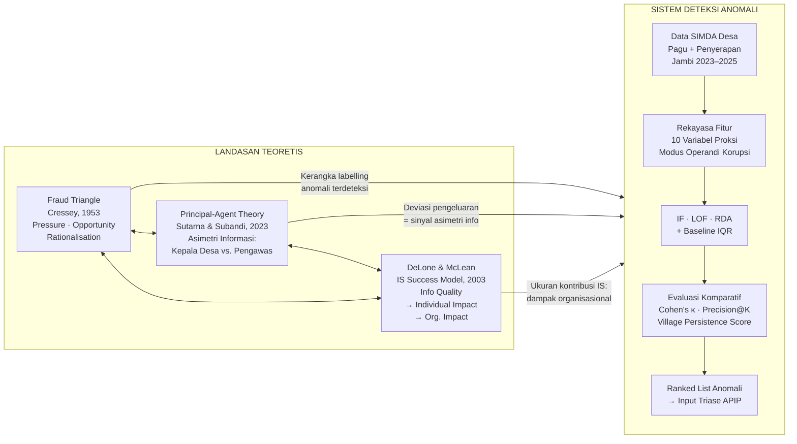
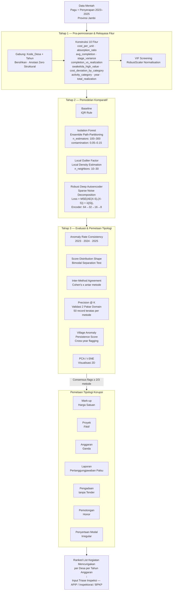

# PROPOSAL PENELITIAN PEMBINAAN/PENGEMBANGAN (PPB)

**Judul Penelitian:**
**Deteksi Indikasi Korupsi Dana Desa Berbasis Unsupervised Learning: Studi Komparatif Isolation Forest, Local Outlier Factor, dan Robust Deep Autoencoder pada Data Penyerapan Anggaran Provinsi Jambi 2023–2025**

---

## PENDAHULUAN

### A. Latar Belakang dan Rumusan Permasalahan

Indonesia mengalokasikan dana desa sebesar lebih dari Rp 71 triliun per tahun kepada 75.259 desa di seluruh wilayah [1]. Namun, besaran alokasi tersebut berbanding lurus dengan risiko penyimpangan: Indonesian Corruption Watch (ICW) mencatat 591 putusan pengadilan terkait korupsi dana desa sepanjang 2024, menjerat 640 terdakwa dengan total kerugian negara Rp 598,13 miliar [2]. Komisi Pemberantasan Korupsi (KPK) mengidentifikasi 851 kasus korupsi dana desa sejak 2015, dengan kepala desa sebagai pelaku lebih dari 60% kasus [3].

Respons kelembagaan yang berlaku saat ini bersifat reaktif — penindakan hukum setelah kerugian terjadi. Infrastruktur pelaporan keuangan pemerintah, khususnya SIMDA Desa yang dikelola BPKP, menghasilkan data penyerapan anggaran per kegiatan secara granular: jenis kegiatan, pagu anggaran, realisasi per tahap pencairan, dan metode pengadaan. Namun, tidak ada mekanisme skrining berbasis data yang beroperasi di tingkat kabupaten atau provinsi untuk mendeteksi anomali tersebut secara sistematis [4, 5].

Empat kasus yang sedang dalam proses penuntutan di Provinsi Jambi (2024–2026) mendokumentasikan kerugian negara terverifikasi sebesar Rp 2,301 miliar [25, 26, 27, 28]. Selang waktu antara tahun anggaran penyimpangan hingga penindakan berkisar dua hingga lima tahun — interval di mana deteksi anomali berbasis data berpotensi menekan akumulasi kerugian negara lintas siklus pencairan. Dari sisi pengawasan partisipatif, platform jaga.id mencatat hanya 11 aduan dari Jambi (1,4% dari 761 laporan nasional) [10], mengindikasikan kondisi *low-monitoring environment* — absennya laporan bukan berarti absennya fraud, melainkan absennya tekanan pertanggungjawaban yang beroperasi di luar siklus audit formal.

Srirejeki dan Faturokhman [8] mendokumentasikan bahwa inspektorat kabupaten kekurangan tenaga untuk menyaring ribuan catatan kegiatan per siklus pencairan. Alfada [9] membuktikan secara empiris bahwa daerah dengan ketergantungan transfer fiskal tinggi dan akuntabilitas lemah menunjukkan insidensi korupsi yang secara sistematis lebih tinggi — profil struktural yang berlaku untuk tata kelola dana desa Jambi.

**Rumusan masalah penelitian ini adalah:** diberikan data penyerapan anggaran per kegiatan yang tidak berlabel (*unlabelled*), apakah metode *unsupervised learning* dapat secara andal mengidentifikasi pola pengeluaran yang berkorespondensi dengan modus operandi korupsi yang terdokumentasi? Dan di antara Isolation Forest, Local Outlier Factor (LOF), serta Robust Deep Autoencoder (RDA), metode mana yang menghasilkan diskriminasi terbaik antara profil kegiatan mencurigakan dan profil normal?

### B. Pendekatan Pemecahan Masalah

Penelitian ini mengusulkan *pipeline* deteksi anomali berbasis *unsupervised learning* yang beroperasi pada data aktivitas-level dari SIMDA Desa. Tidak seperti pendekatan *supervised* yang mensyaratkan label ground truth — kemewahan yang tidak tersedia dalam konteks pemantauan real-time [12] — ketiga metode yang diusulkan beroperasi pada data tidak berlabel. Anomali yang teridentifikasi kemudian diinterpretasikan melalui peta tipologi korupsi modus operandi yang bersumber dari putusan pengadilan dan laporan audit institusional [4, 22].

Keluaran sistem adalah *ranked list* kegiatan mencurigakan per desa yang dapat langsung digunakan sebagai input triase inspeksi bagi Aparat Pengawas Internal Pemerintah (APIP) — mengoperasionalkan jalur *information quality → individual impact → organisational impact* yang diidentifikasi DeLone dan McLean [7] sebagai kriteria keberhasilan sistem IS dalam konteks kelembagaan.

### C. *State of the Art* dan Kebaruan

Studi mutakhir menunjukkan bahwa *unsupervised learning* semakin dominan dalam deteksi anomali keuangan publik: Li et al. [15] menerapkan Isolation Forest dan LOF pada data belanja federal AS (2025); De Meulemeester et al. [16] membuktikan bahwa rekonstruksi *per-feature* autoencoder menghasilkan diagnostik variabel yang dapat diinterpretasi oleh auditor; Alam et al. [17] menyimpulkan bahwa perbandingan multi-paradigma adalah praktik terbaik metodologis untuk *benchmarking* deteksi anomali.

Studi pada data keuangan publik Indonesia terbatas pada prokuremen agregat nasional [14] atau klasifikasi *supervised* dana desa [13]. Screening sistematis catatan aktivitas SIMDA Desa menggunakan metode *unsupervised* belum diteliti [12]. Kebaruan penelitian ini mencakup: (1) penerapan pertama *unsupervised anomaly detection* pada data aktivitas-level Siskeudes/SIMDA Desa, (2) perbandingan tiga paradigma algoritmik berbeda pada domain keuangan desa Indonesia, (3) pemetaan langsung *flag* anomali ke modus operandi dari putusan pengadilan, dan (4) *village-level anomaly persistence score* lintas tiga tahun anggaran sebagai alat prioritisasi inspeksi.

### D. Peta Jalan (*Road Map*) Penelitian 2026–2028

Peta jalan riset ini merupakan bagian dari **Faculty Member Roadmap for Research, Empowerment, & Technology Transfer** yang ditetapkan untuk periode 2026–2028, dengan mitra utama riset Komisi Pemberantasan Korupsi (KPK) — Divisi Pencegahan, dan target hibah Hibah Internal serta Hibah Nasional DIKTI. Topik SDGs yang diprioritaskan adalah **SDG 11** (Kota dan Komunitas Berkelanjutan) dan **SDG 17** (Kemitraan untuk Tujuan).

| Aspek | **2026** | **2027** | **2028** |
|-------|----------|----------|----------|
| **Topik Penelitian Prioritas** | *Corruption Indication Detection in Village Fund Activities* — konsep, analisis data, dan kualitas model (baseline *unsupervised* ML) | *Enhancing Corruption Indication Detection in Village Fund Activities Using Semantic Language Modelling Methods* | *Improving Corruption Indication Detection in Village Fund Activities for Decision Support Using Fine-Tuned Large Language Model* |
| **Rencana Kerja Riset** | *Baseline study*: penentuan lingkup pengumpulan data 1 provinsi; 1 draft artikel; eksperimen perbandingan metode *unsupervised*. **Output**: dataset pagu dan penyerapan Dana Desa, *script* analisis dan *train* ML, draft artikel publikasi | *Baseline study*: ekspansi lingkup 5–15 provinsi; 1 draft artikel; eksperimen perbandingan metode NLP semantik dan vektorisasi kategori. **Output**: dataset multi-provinsi, *script* analisis dan *train* model, *dashboard panel*, draft artikel publikasi | *Enhanced study*: ekspansi 5–15 provinsi; 1 artikel paper + 1 jurnal; eksperimen *fine-tuning* LLM dan teknik *embedding* input. **Output**: dataset multi-provinsi, *script* analisis dan *train* model, pemutakhiran prototipe dengan *bot analysis*, draft artikel publikasi |
| **Target Hibah** | Hibah Internal; Hibah Nasional – DIKTI | Hibah Internal; Hibah Nasional – DIKTI | Hibah Internal; Hibah Nasional – DIKTI |
| **Kegiatan *Community Empowerment*** | Instansi/Organisasi Aparat Penegak Hukum + Workshop + *Awareness Meeting* + *Experimental Validation* + Konsep Sistem + Laporan Analisis & *Awareness* | Instansi/Organisasi Aparat Penegak Hukum + Workshop + *Awareness Meeting* + *Experimental Validation* + Konsep Sistem + Prototipe + Laporan Analisis & *Awareness* | Instansi/Organisasi Aparat Penegak Hukum + Workshop + *Awareness Meeting* + *Experimental Validation* + Konsep Sistem + Prototipe + *Production-ready System* + Laporan Analisis & *Awareness* |
| **Target Wilayah Binaan** | DKI Jakarta (Instansi Pemerintahan); Rawa Belong (Tentatif) | DKI Jakarta (Instansi Pemerintahan); Rawa Belong (Tentatif) — usulan wilayah binaan baru mulai 2027 | DKI Jakarta (Instansi Pemerintahan); Rawa Belong (Tentatif) |
| **Teknologi / Produk** | Konsep, analisis data, dan kualitas model | Prototipe, MVP, *pilot* | Standardisasi, replikasi/skalabiliti sistem, implementasi internal organisasi |
| **Capaian TKT** | TKT 1–3 | Prototipe, MVP, *pilot* | Standardisasi, replikasi/skalabiliti sistem, implementasi internal organisasi |
| **Integrasi ke Pengajaran** | IT Governance & Security; Foundations of AI; IS Analysis and Design; Data and Information Management; Modern Analytics; Social Informatics | IT Governance & Security; Foundations of AI; IS Analysis and Design; Data and Information Management; Modern Analytics; Social Informatics | IT Governance & Security; Foundations of AI; IS Analysis and Design; Data and Information Management; Modern Analytics; Social Informatics |
| **Pemanfaatan AI** | *AI Implementation*: analisis data & eksperimental | *AI Implementation*: analytics, pembuatan instrumen, *insight*, *thematic summarization* | *AI Utilization*: analisis data, *coding*, *modeling*, pembuatan instrumen, *action recommender*, *bot interaction* |
| **Mitra Utama Riset & Komunitas** | KPK — Divisi Pencegahan | KPK — Divisi Pencegahan | KPK — Divisi Pencegahan |

### E. Sitasi
Sitasi disusun berdasarkan sistem nomor sesuai urutan pengutipan (format Vancouver). Lihat Daftar Pustaka.

---

## TINJAUAN PUSTAKA

### *State of the Art* dan Peta Jalan Bidang yang Diteliti

**Korupsi Dana Desa — Konteks Indonesia.** Penelitian pada dana desa Indonesia didominasi analisis legal-forensik dan tata kelola. Purba et al. [21] mengklasifikasikan modus operandi korupsi dana desa menggunakan analisis penipuan, mengidentifikasi manipulasi pelaporan pertanggungjawaban sebagai modalitas paling persisten. Hidajat [4] mengaplikasikan Diamond Fraud Theory dan mendokumentasikan lima mode korupsi rekuren: penyalahgunaan dana, skema penutupan, laporan fiktif, kegiatan fiktif, dan *mark-up* anggaran. Prihatmanto et al. [22] memetakan pola korupsi berbasis putusan ICW, mengidentifikasi ketidaksesuaian realisasi fisik sebagai sinyal utama. Maulana [23] mendokumentasikan risiko struktural dalam pengelolaan anggaran desa terkait pengadaan *swakelola* bernilai tinggi. Studi-studi ini konsisten menggunakan kerangka hukum dan tata kelola, bukan komputasional — celah yang penelitian ini tutup secara langsung.

**Machine Learning untuk Deteksi Fraud Keuangan Publik.** Lyra et al. [11] melakukan *systematic literature review* terhadap metode berbasis data untuk deteksi fraud dalam pengadaan publik dan menyimpulkan bahwa *unsupervised* dan *semi-supervised learning* memiliki relevansi paling tinggi pada konteks tanpa label ground truth. Husnaningtyas dan Dewayanto [12] mengkonfirmasi bahwa pendekatan *unsupervised* masih langka dalam deteksi fraud keuangan Indonesia dibanding *supervised* learning. Harriz et al. [13] — satu-satunya studi ML spesifik dana desa yang teridentifikasi — menerapkan CatBoost *supervised* pada data Jawa Barat, yang mensyaratkan data berlabel. Ambarsari dan Desyanti [14] menerapkan Isolation Forest pada data prokuremen nasional Indonesia, namun tidak memetakan output ke tipologi korupsi spesifik.

**Algoritma Deteksi Anomali.** Liu et al. [18] memperkenalkan Isolation Forest — ensemble pohon acak yang mengisolasi anomali berdasarkan panjang jalur partisi. Pada data tabular keuangan pemerintah, Li et al. [15] mengkonfirmasi IF sebagai standar Tier-1 dan menemukan LOF mengidentifikasi subset anomali yang berbeda — terutama yang tertanam dalam kategori kegiatan berfrekuensi tinggi. Breunig et al. [19] memperkenalkan LOF, yang mengukur deviasi kepadatan lokal relatif terhadap tetangga k-terdekat tanpa parameter kepadatan global, menjadikannya unggul pada data berdistribusi heterogen seperti catatan penyerapan dana desa. Zhou dan Paffenroth [20] mengusulkan Robust Deep Autoencoder (RDA) yang mendekomposisi matriks input secara bersama menjadi komponen normal rekonstruksi jaringan saraf dan matriks *noise* jarang **S**, dengan fungsi objektif: `Loss = MSE(AE(X−S), (X−S)) + λ‖S‖₁`. Dekomposisi ini memisahkan catatan anomali dari representasi laten yang dipelajari, mengatasi kelemahan kontaminasi pelatihan autoencoder standar. Kumar et al. [24] serta De Meulemeester et al. [16] memvalidasi keunggulan RDA dalam mendeteksi pola anomali majemuk non-linear dan menghasilkan diagnostik *per-feature* yang dapat ditindaklanjuti auditor.

**Posisi Teoretis.** Secara teori, penelitian ini berpijak pada tiga kerangka: (1) *Fraud Triangle* [4] — mengoperasionalkan tekanan-kesempatan-rasionalisasi sebagai kerangka interpretasi anomali yang terdeteksi; (2) Teori Principal-Agent [6] — informasi asimetris kepala desa terhadap pengawas kabupaten direpresentasikan sebagai deviasi pengeluaran yang tidak dapat dijelaskan; (3) DeLone & McLean IS Success Model [7] — kualitas informasi sistem (sinyal anomali akurat) menghasilkan dampak individual (perhatian auditor) dan dampak organisasional (pencegahan korupsi), menegaskan kontribusi penelitian ini sebagai intervensi IS yang bermakna.

**Celah yang Ditutup.** Tidak ada studi yang menerapkan *unsupervised anomaly detection* pada data aktivitas-level SIMDA Desa, memetakan output ke tipologi modus operandi dari putusan pengadilan, membandingkan tiga paradigma algoritmik berbeda (partisi ensemble, estimasi kepadatan lokal, rekonstruksi jarang mendalam), atau menghasilkan skor persistensi anomali lintas tiga tahun anggaran sebagai alat prioritisasi inspeksi.

> *Catatan*: Diagram kerangka konseptual penelitian (peta interaksi variabel, alur pipeline deteksi, dan diagram teoretis) tersedia dalam folder `docs/diagrams/` dan akan dilampirkan pada dokumen akhir dalam format PNG.

---

## METODOLOGI PENELITIAN

### Metode Pencapaian Tujuan

Penelitian ini menggunakan desain studi komparatif *unsupervised learning* dengan data sekunder longitudinal (2023–2025) dari SIMDA Desa Provinsi Jambi. Unit analisis adalah catatan kegiatan per desa per tahun anggaran (estimasi 33.000+ record). Tiga tahap utama dilaksanakan secara sekuensial:

**Tahap 1 — Pra-pemrosesan dan Rekayasa Fitur.** Data Pagu (plafon anggaran) dan Penyerapan (realisasi per tahap) digabungkan berdasarkan *Kode_Desa* + *Tahun*. Sepuluh fitur rekayasa dikonstruksi sebagai proksi komputasional modus operandi korupsi terdokumentasi [4, 22]:

| Fitur | Modus Operandi Ditarget |
|-------|------------------------|
| `cost_per_unit` | *Mark-up* harga satuan |
| `absorption_ratio` | Proyek fiktif (realisasi mendekati nol) |
| `avg_completion` | Laporan penyelesaian dimanipulasi |
| `stage_variance` | Pola pencairan tidak teratur |
| `completion_vs_realization` | Inkonsistensi persentase vs. realisasi nyata |
| `swakelola_high_value` | Pengadaan *swakelola* bernilai tinggi tanpa lelang |
| `cost_deviation_by_category` | Outlier biaya dalam kategori kegiatan yang sama |
| `activity_category`, `year`, `total_realization` | Konteks tipologi dan besaran |

Normalisasi menggunakan RobustScaler (median/IQR) untuk mereduksi distorsi akibat anomali. Skrining VIF diterapkan untuk menghilangkan multikolinearitas (ambang VIF > 5).

**Tahap 2 — Pemodelan Komparatif.** Tiga metode *unsupervised* diterapkan secara paralel pada matriks fitur yang sama, dengan baseline statistik IQR sebagai acuan pembanding:

- **Isolation Forest (IF)** [18]: `n_estimators` = 100–300; `contamination` = 0,05–0,15
- **Local Outlier Factor (LOF)** [19]: `n_neighbors` = 10–30; threshold ≥ persentil ke-95
- **Robust Deep Autoencoder (RDA)** [20]: Encoder 64→32→16→8 neuron; λ disapu pada [1e-4, 1e-3, 1e-2]; optimiser Adam; *early stopping* dengan sabar 10 epoch

**Tahap 3 — Evaluasi dan Pemetaan Tipologi.** Evaluasi tanpa label ground truth menggunakan: (a) konsistensi anomaly rate lintas tahun 2023–2025, (b) distribusi skor, (c) Inter-Method Agreement (Cohen's κ antar metode), (d) Precision@K berbasis validasi 2 pakar domain (rubrik Suspicious / Not Suspicious pada 50 record teratas per metode), (e) Village Anomaly Persistence Score (proporsi tahun anggaran dengan ≥1 flag per desa), dan (f) visualisasi PCA/t-SNE. Flag konsensus (≥2 dari 3 metode) dipetakan ke tujuh tipologi modus operandi.

### Diagram 1 — Kerangka Konseptual Teoretis (Mermaid)

### Diagram 2 — Alur Pipeline Penelitian (Mermaid)

### Tugas Anggota Peneliti

| Anggota | Peran | Tahapan |
|---------|-------|---------|
| Ketua Peneliti | Desain keseluruhan, rekayasa fitur, penulisan artikel | Tahap 1–3 penuh |
| Anggota 1 | Implementasi pemodelan IF dan LOF, evaluasi statistik | Tahap 2–3 |
| Anggota 2 | Implementasi RDA, validasi pakar, visualisasi | Tahap 2–3 |
| Mahasiswa Asisten | Pengumpulan dan pra-pemrosesan data | Tahap 1 |

---

## JADWAL PENELITIAN

| No | Kegiatan | Bln 1 | Bln 2 | Bln 3 | Bln 4 | Bln 5 | Bln 6 | Bln 7 | Bln 8 | Bln 9 | Bln 10 | Bln 11 | Bln 12 |
|----|----------|:-----:|:-----:|:-----:|:-----:|:-----:|:-----:|:-----:|:-----:|:-----:|:------:|:------:|:------:|
| 1 | Studi literatur lanjutan dan finalisasi kerangka teoritis | ✓ | ✓ | | | | | | | | | | |
| 2 | Pengumpulan dan validasi data SIMDA Desa Prov. Jambi 2023–2025 | ✓ | ✓ | ✓ | | | | | | | | | |
| 3 | Pra-pemrosesan data: penggabungan, pembersihan, anotasi zero struktural | | | ✓ | ✓ | | | | | | | | |
| 4 | Rekayasa fitur: konstruksi 10 variabel, skrining VIF, RobustScaler | | | | ✓ | ✓ | | | | | | | |
| 5 | Implementasi Isolation Forest dan tuning parameter | | | | | ✓ | ✓ | | | | | | |
| 6 | Implementasi Local Outlier Factor dan tuning parameter | | | | | | ✓ | ✓ | | | | | |
| 7 | Implementasi Robust Deep Autoencoder (RDA) dan tuning λ | | | | | | ✓ | ✓ | ✓ | | | | |
| 8 | Evaluasi komparatif: IQR baseline, Cohen's κ, Precision@K | | | | | | | | ✓ | ✓ | | | |
| 9 | Validasi pakar domain (APIP/auditor) — rubrik 50 record teratas | | | | | | | | | ✓ | ✓ | | |
| 10 | Pemetaan tipologi korupsi dan Village Persistence Score | | | | | | | | | | ✓ | ✓ | |
| 11 | Penulisan artikel dan submission ke jurnal Scopus Q2 | | | | | | | | | ✓ | ✓ | ✓ | ✓ |
| 12 | Penyusunan laporan akhir penelitian | | | | | | | | | | | ✓ | ✓ |

---
## RINCIAN ANGGARAN PENELITIAN

**Total Anggaran: Rp 10.000.000 (Satu Tahun)**

| No | Budget Type | Budget Type Sub Component | Item Usability | Item Name | Item Quantity | Item Measure | Amount (Rp) | Total Amount (Rp) |
|----|-------------|--------------------------|----------------|-----------|:-------------:|:------------:|------------:|------------------:|
| 1 | Bahan Habis Pakai | ATK & Media Penyimpanan | Penyusunan laporan, dokumentasi penelitian, dan backup dataset SIMDA Desa | Kertas A4 (2 rim), Tinta Printer (1 set), Flashdisk 64GB (2 pcs) | 1 | Paket | 650.000 | 650.000 |
| 2 | Jasa Komputasi & Layanan Digital | Infrastruktur Komputasi & Akses Literatur | Training model RDA berbasis GPU cloud dan akses artikel jurnal Scopus/Emerald/Springer | Google Colab Pro (6 bulan) + Layanan akses e-journal & database ilmiah | 1 | Paket | 1.800.000 | 1.800.000 |
| 3 | Honorarium | Pakar Domain & Asisten Penelitian | Validasi 50 record teratas per metode (rubrik Suspicious/Not Suspicious) dan pra-pemrosesan data | Honorarium validator pakar APIP/auditor (2 orang) + Mahasiswa asisten penelitian (4 bulan) | 1 | Paket | 2.600.000 | 2.600.000 |
| 4 | Perjalanan, Koordinasi & Diseminasi | Transport, Rapat Tim, Konferensi & Konsumsi | Pengambilan data ke BPKP/Inspektorat, koordinasi tim, presentasi hasil di forum ilmiah nasional | Transport pengambilan data (5×) + Rapat koordinasi tim (6×) + Registrasi konferensi nasional (1×) + Konsumsi rapat (8×) | 1 | Paket | 3.700.000 | 3.700.000 |
| 5 | Laporan & Publikasi | Penggandaan Laporan & Penyuntingan Naskah | Distribusi laporan akhir ke lembaga mitra dan submission artikel ke jurnal Scopus | Penggandaan & penjilidan laporan akhir (5 eks) + Proofreading & language editing artikel ilmiah (1 naskah) | 1 | Paket | 1.250.000 | 1.250.000 |
| | | | | | | **TOTAL** | | **10.000.000** |

---
## DAFTAR PUSTAKA

1. Kementerian Koordinator Bidang PMK. Evaluasi Dana Desa 2023–2024. Antara News [Internet]. 2024 Sep [cited 2026 Apr]. Available from: https://www.antaranews.com/berita/4323375/kemenko-pmk-sebut-korupsi-dana-desa-masih-perlu-perhatian-khusus

2. Indonesian Corruption Watch (ICW). Laporan Hasil Pemantauan Tren Korupsi Tahun 2023. Jakarta: ICW; 2024 May. Available from: https://www.antikorupsi.org/sites/default/files/dokumen/Narasi%20Laporan%20Hasil%20Pemantauan%20Tren%20Korupsi%20Tahun%202023.pdf

3. Komisi Pemberantasan Korupsi (KPK). Laporan Tahunan KPK 2023. Jakarta: KPK; 2023. Available from: https://www.kpk.go.id/id/publikasi/laporan-tahunan/3398-laporan-tahunan-kpk-2023/

4. Hidajat T. Village fund corruption mode: an anti-corruption perspective in Indonesia. J Financ Crime. 2025;32(2):444–58. doi:10.1108/JFC-01-2024-0042

5. Permatasari P, Budiarso A, Dartanto T. Village fund management and reporting systems: are they accountable? Transform Gov People Process Policy. 2024;18(4):512–29. doi:10.1108/TG-07-2023-0098

6. Sutarna IT, Subandi A. Korupsi dana desa dalam perspektif principal-agent. J Adm Pemerintahan Desa. 2023;4(2). doi:10.47134/villages.v4i2.52

7. DeLone WH, McLean ER. The DeLone and McLean model of information systems success: a ten-year update. J Manag Inf Syst. 2003;19(4):9–30. doi:10.1080/07421222.2003.11045748

8. Srirejeki K, Faturokhman A. In search of corruption prevention model: case study from Indonesia village fund. Acta Univ Danubius Oeconomica. 2020;16(3):214–29. Available from: https://doaj.org/article/01b1588b59f149ba82d6ef47dddaca0a

9. Alfada A. Does fiscal decentralization encourage corruption in local governments? Evidence from Indonesia. J Risk Financ Manag. 2019;12(3):118. doi:10.3390/jrfm12030118

10. Jaga.id. Rekap Laporan Dana Desa per Provinsi [Internet]. 2026 [cited 2026 Apr]. Available from: https://jaga.id

11. Lyra MS, Damásio B, Pinheiro FL, Bacao F. Fraud, corruption, and collusion in public procurement activities, a systematic literature review on data-driven methods. Appl Netw Sci. 2022;7(1):78. doi:10.1007/s41109-022-00523-6

12. Husnaningtyas N, Dewayanto T. Financial fraud detection and machine learning algorithm (unsupervised learning): systematic literature review. J Riset Akunt Bisnis Airlangga. 2023. Available from: https://e-journal.unair.ac.id/jraba/article/download/49927/26752

13. Harriz MA, Akbariani NV, Setiyowati H. Classifying village fund in West Java, Indonesia using catboost algorithm. J Indones Manaj Inform Komun. 2023;4(2). Available from: http://journal.stmiki.ac.id/index.php/jimik/article/view/269

14. Ambarsari EW, Desyanti D. Hybrid chaos-isolation forest framework for anomaly detection in Indonesia's public procurement. Bull Inform Data Sci. 2025. doi:10.ejurnal.pdsi.or.id/index.php/bids/article/view/137

15. Li B, Kaplan B, Lazirko M, Kogan A. Unsupervised outlier detection in audit analytics: a case study using USA spending data. arXiv preprint arXiv:2509.19366. 2025. Available from: https://arxiv.org/abs/2509.19366

16. De Meulemeester H, De Smet F, van Dorst J, et al. Explainable unsupervised anomaly detection for healthcare insurance data. BMC Med Inform Decis Mak. 2025;25. doi:10.1186/s12911-024-02823-6

17. Alam MN, Laxmi V, Kumar N, Kumari R. Unsupervised machine learning for anomaly detection: a systematic review. Int J Intell Syst. 2025. Available from: https://www.researchgate.net/publication/394263593

18. Liu FT, Ting KM, Zhou Z-H. Isolation forest. In: Proceedings of the 8th IEEE International Conference on Data Mining (ICDM 2008); 2008 Dec 15–19; Pisa, Italy. IEEE; 2008. p. 413–22. doi:10.1109/ICDM.2008.17

19. Breunig MM, Kriegel H-P, Ng RT, Sander J. LOF: identifying density-based local outliers. In: Proceedings of the ACM SIGMOD International Conference on Management of Data; 2000 May 15–18; Dallas, TX. ACM; 2000. p. 93–104. doi:10.1145/342009.335388

20. Zhou C, Paffenroth RC. Anomaly detection with robust deep autoencoders. In: Proceedings of the 23rd ACM SIGKDD International Conference on Knowledge Discovery and Data Mining; 2017 Aug 13–17; Halifax, Canada. ACM; 2017. p. 665–74. doi:10.1145/3097983.3098052

21. Purba RB, Aulia F, Tarigan VCE, Pramono AJ, Umar H. Detection of corruption in village fund management using fraud analysis. Calitatea. 2022;23. Available from: https://www.academia.edu/download/92271721/Detection_of_Corruption_in_Village_Fund_Management_using_Fraud_Analysis.pdf

22. Prihatmanto HN, Artha AD, et al. Recognising and detecting patterns of village corruption in Indonesia. Integritas J Antikorupsi. 2022. Available from: https://pdfs.semanticscholar.org/e081/cd0e420cd3deeb4e1e5c9ee106e34504fda3.pdf

23. Maulana M. Risiko korupsi pengelolaan anggaran desa. ARMADA J Penelit Multidisiplin. 2023;1(3). doi:10.55681/armada.v1i3.435

24. Kumar A, Kumar A, Raja R, Dewangan AK. Revolutionising anomaly detection: a hybrid framework integrating isolation forest, autoencoder, and Conv. LSTM. Knowl Inf Syst. 2025. doi:10.1007/s10115-025-02580-6

25. JambiTV Disway. Eks Kades Muara Hemat jalani tahap 2 kasus dugaan korupsi dana desa [Internet]. 2026 Feb [cited 2026 Apr]. Available from: https://jambitv.disway.id/hukum/read/12500/eks-kades-muara-hemat-jalani-tahap-2-kasus-dugaan-korupsi-dana-desa

26. JambiTV Disway. Dana desa Jambi Tulo dibekukan: Inspektorat temukan dugaan kegiatan fiktif Rp300 juta lebih [Internet]. 2025 [cited 2026 Apr]. Available from: https://jambitv.disway.id/muaro-jambi/read/12087/dana-desa-jambi-tulo-dibekukan-inspektorat-temukan-dugaan-kegiat-fiktif-rp300-juta-lebih

27. Kompas.com. Kades hingga mantan kades di Kerinci, Jambi korupsi Rp 644 juta dana desa [Internet]. 2025 Aug [cited 2026 Apr]. Available from: https://regional.kompas.com/read/2025/08/20/213221778/kades-hingga-mantan-kades-di-kerinci-jambi-korupsi-rp-644-juta-dana-desa

28. JambiLINK.id. Tersangka korupsi dana desa Pangkal Duri ditangkap, kerugian negara capai Rp 415 juta [Internet]. 2024 Aug [cited 2026 Apr]. Available from: https://jambilink.id/post/951/tersangka-korupsi-dana-desa-pangkal-duri-ditangkap-kerugian-negara-capai-rp-415-juta
