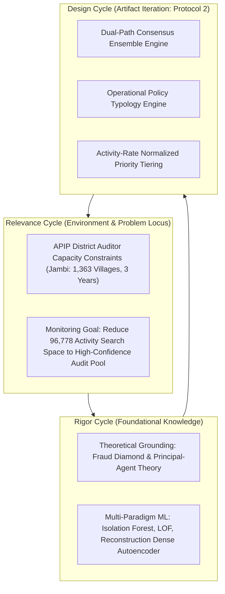
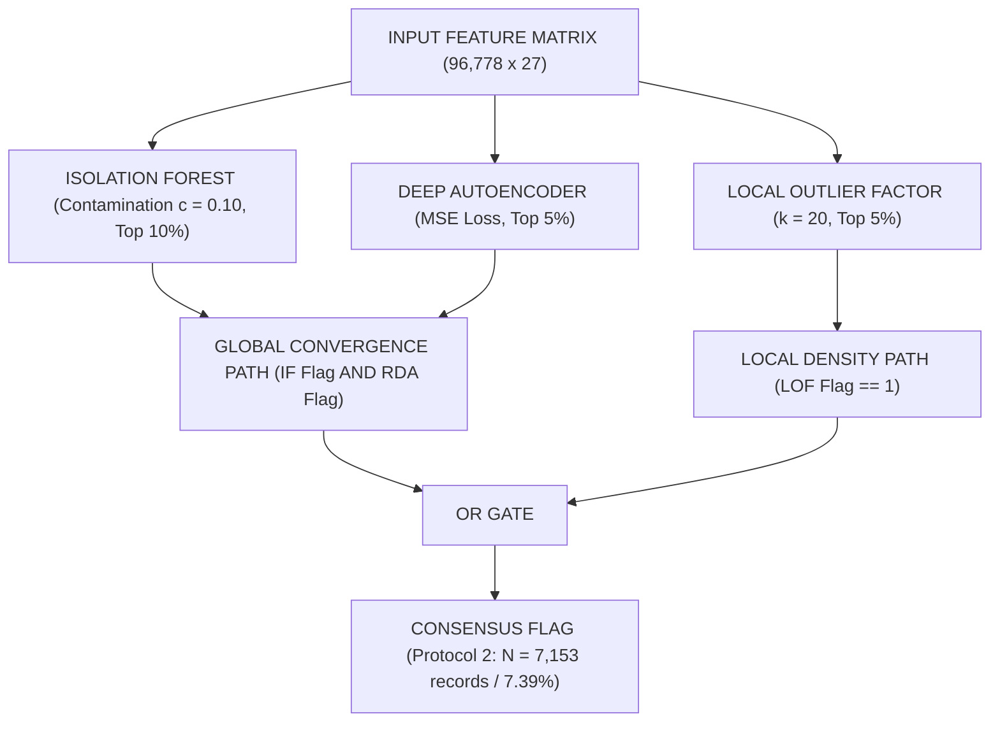

# Chapter 3: Methodology

> **Draft Status**: July 2026 (Full mathematical formalization & Dual-Path Consensus Gate)  
> **Target Venue**: ICCSCI (Procedia Computer Science, Elsevier)  
> **Word Count Target**: ~1,250 words  
> **Citation Format**: IEEE (continuous numbering per references.md)  

---

## 3. Methodology

### 3.1 Design Science Research (DSR) Framework

This study adheres strictly to the Design Science Research (DSR) methodology for Information Systems [5, 10], structuring artifact iteration across three primary cycles:
1. **Relevance Cycle**: Addresses the institutional monitoring problem across 96,778 village fund activity entries in Jambi Province under severe APIP district auditor capacity constraints.
2. **Rigor Cycle**: Grounds feature construction in Agency Theory (principal-agent information asymmetry) and Fraud Diamond dynamics, drawing algorithms from multi-paradigm anomaly detection literature [18, 24, 32].
3. **Design Cycle**: Iteratively constructs the IT artifact comprising three core components: (a) robust feature engineering with regional baseline centering, (b) a Dual-Path Consensus Machine Learning engine, and (c) an Operational Policy Mapping Layer.



### 3.2 Dataset Cleaning & Record Filtering Audit

The dataset combines two administrative data sources collected via the KPK `jaga.id` open transparency portal [26]: (1) **Penyerapan** (expenditure absorption) records documenting realised spending per activity per tranche, and (2) **Pagu** (approved budget ceiling) records. Merging via composite key `Kode_Desa` $\times$ `Tahun` across fiscal years 2023, 2024, and 2025 yielded an initial raw corpus of 99,692 activity entries.

In Protocol 2, a rigorous data hygiene audit was performed within a standardized Python computational execution environment. A total of **2,914 zero-volume or corrupted activity records** ($\text{Volume} \le 0$ or invalid `Kode_Output` codes) were filtered out. In baseline Protocol 1, zero-volume records caused division-by-zero errors when calculating unit cost ($\text{Realization} \div \text{Volume}$), distorting RobustScaler bounds. Eliminating these invalid records yielded a cleaned longitudinal panel of **96,778 activity-level records** across **1,363 villages** (33,065 in 2023; 34,710 in 2024; 29,003 in 2025).

### 3.3 Geographical Baseline Centering & Engineered Feature Matrix

Seven core feature constructs were engineered to operationalise documented corruption modus operandi [13, 14]:

| Feature Construct | Mathematical Expression / Definition | Targeted Modus Operandi |
|---|---|---|
| `cost_per_unit` | $\text{Realization\_Total}_i / \text{Volume}_i$ (RobustScaler OHE) | Unit price mark-up / inflation (T1) |
| `absorption_ratio` | $\text{Realization\_Total}_i / \text{Pagu\_Village}_{v,t}$ | Ghost activity / zero physical progress (T2) |
| `avg_completion` | $\frac{1}{3}(\text{Pct\_T1}_i + \text{Pct\_T2}_i + \text{Pct\_T3}_i)$ | Completion reporting manipulation |
| `swakelola_high_value` | $\mathbf{1}\left(\text{Cara\_Pengadaan}_i = \text{Swakelola} \land \text{Realization}_i > Q_{0.75}\right)$ | Uncompetitive procurement irregularity (T5) |
| `cost_deviation_by_category` | $z_{i,c,k,t} = \frac{x_{i,c,k,t} - \mu_{c,k,t}}{\sigma_{c,k,t}}$ within $(c, k, t)$ group | Within-category regional price outlier (T7) |
| `n_stages_active` | $\sum_{m=1}^{3} \mathbf{1}\left(\text{Real\_T}m_i > 0\right)$ (Metadata Annotation) | Disbursement tranche concentration |
| `activity_category` | One-Hot Encoded 2-digit `Kode_Output` prefix | Cross-category expenditure dumping (T7) |

> **Geographical Baseline Centering Protocol:** To prevent remote highland jurisdictions (e.g., Kabupaten Kerinci) from generating systematic false-positive flags due to elevated baseline transportation costs, `cost_deviation_by_category` calculates year-stratified z-scores strictly within the combined grouping $(c, k, t) = (\text{Kode\_Output}, \text{Kabupaten\_Kota}, \text{Tahun})$. This controls for regional logistics overhead while preserving sensitivity to local price manipulation.

All continuous features were scaled using **RobustScaler** (median centring, IQR scaling), resisting distortion by extreme outlier records.

### 3.4 Algorithmic Paradigm Specifications

#### 1. Isolation Forest (Global Sparsity Engine)
Isolation Forest partitions the feature space via recursive random splits [18]. For sample $x$, path length $h(x)$ across $T=200$ trees determines anomaly score $s(x, n) = 2^{-\mathbb{E}(h(x))/c(n)}$. Contamination $c = 0.10$ sets the decision function at the 90th percentile:
$$\text{IF-Flag}_i = \mathbf{1}\left(s(x_i, n) \ge \text{Quantile}_{0.90}(s)\right) \implies N_{\text{IF}} = 9,678 \text{ records (10.00\%)}$$

#### 2. Local Outlier Factor (Density Ratio Engine)
LOF computes the local reachability density ($\text{lrd}_k$) ratio between instance $p$ and its $k=20$ nearest neighbors [24]:
$$\text{LOF}_k(p) = \frac{\sum_{o \in N_k(p)} \frac{\text{lrd}_k(o)}{\text{lrd}_k(p)}}{|N_k(p)|}$$
Flagging threshold is set at the 95th percentile:
$$\text{LOF-Flag}_i = \mathbf{1}\left(\text{LOF}_k(x_i) \ge \text{Quantile}_{0.95}(\text{LOF})\right) \implies N_{\text{LOF}} = 4,839 \text{ records (5.00\%)}$$

#### 3. Reconstruction Dense Autoencoder (RDA & Neural Loss Attribution)
The RDA network features an 8-layer symmetric bottleneck structure `[27 -> 64 -> 32 -> 16 -> 8 -> 16 -> 32 -> 64 -> 27]` trained with MSE loss and $L_2$ weight regularization ($\lambda = 1\times 10^{-3}$). Reconstruction error $E_i$ and per-feature contribution $e_{i,f}$ are computed as:
$$E_i = \sum_{f=1}^{d} \left(x_{i,f} - \hat{x}_{i,f}\right)^2, \quad e_{i,f} = \frac{\left(x_{i,f} - \hat{x}_{i,f}\right)^2}{E_i}$$
$$\text{RDA-Flag}_i = \mathbf{1}\left(E_i \ge \text{Quantile}_{0.95}(E)\right) \implies N_{\text{RDA}} = 4,840 \text{ records (5.00\%)}$$

### 3.5 Dual-Path Consensus Ensemble Gate

In baseline Protocol 1, simple majority voting ($\sum \text{Flag}_m \ge 2$) suffered from severe mutual cancellation because algorithms project onto orthogonal statistical subspaces. In Protocol 2, the **Dual-Path Consensus Ensemble Gate** explicitly decouples local density detection from multi-model global convergence:



$$\text{Consensus-Flag}_i = \text{LOF-Flag}_i \lor \left(\text{IF-Flag}_i \land \text{RDA-Flag}_i\right)$$

This dual-path gate admits **7,153 consensus anomalous records (7.39%)**, capturing 3,940 local density isolates (LOF only) and 2,314 global multi-model convergence records (IF $\cap$ RDA) without admitting uncoordinated single-model noise.

### 3.6 Formal Pseudocode & Interleaved Execution Logic

The operational execution of the DSR artifact proceeds sequentially across three formal algorithms.

**Algorithm 1: Year-Stratified Regional Baseline Centering and Scaling**
```
Input: Raw Dataset D = {x_1, ..., x_N}, Category c_i, Jurisdiction k_i, Year t_i.
Output: Scaled Feature Matrix X in R^{N x d}.
1. Filter invalid records: D_clean <- {x_i in D | Volume_i > 0 AND ValidCode(c_i)}.
2. For each unique stratum (c, k, t):
3.     Extract subgroup records S_{c,k,t} <- {x_i in D_clean | c_i = c AND k_i = k AND t_i = t}.
4.     Compute mean unit cost mu_{c,k,t} and standard deviation sigma_{c,k,t}.
5.     For each record x_i in S_{c,k,t}:
6.         z_{i,cat} <- (CostPerUnit(x_i) - mu_{c,k,t}) / (sigma_{c,k,t} + epsilon).
7. Apply RobustScaler to continuous columns: x_i <- (x_i - Median(X)) / IQR(X).
8. Return Feature Matrix X.
```

The resulting robust feature matrix $\mathbf{X} \in \mathbb{R}^{N \times d}$ generated by Algorithm 1 serves as the standardized input to the multi-paradigm anomaly detection engine. Because individual detection paradigms project onto orthogonal feature subspaces, single-model detectors exhibit blind spots when operating independently. To resolve this, Algorithm 2 executes parallel model training across Isolation Forest, LOF, and RDA, applying the Dual-Path gating logic to synthesize raw anomaly scores into a consensus flag vector $\mathbf{y}_{\text{consensus}}$.

**Algorithm 2: Dual-Path Consensus Ensemble Detection Gate**
```
Input: Feature Matrix X in R^{N x d}, IF contamination c = 0.10, LOF k = 20, RDA bottleneck h = 8, percentile q = 0.95.
Output: Consensus Flag Vector y_consensus in {0, 1}^N.
1. Path A (Global Sparsity): Fit Isolation Forest M_IF(X) with T=200 trees.
2. For i = 1 ... N: y_{i, IF} <- 1(s_IF(x_i) >= Quantile_0.90(s_IF)).
3. Path B (Local Density Ratio): Compute LOF scores LOF_k(x_i).
4. For i = 1 ... N: y_{i, LOF} <- 1(LOF_k(x_i) >= Quantile_0.95(LOF)).
5. Path C (Neural Reconstruction): Train Autoencoder x_hat_i = g_phi(f_theta(x_i)) via MSE loss.
6. For i = 1 ... N: E_i <- ||x_i - x_hat_i||_2^2; y_{i, RDA} <- 1(E_i >= Quantile_0.95(E)).
7. Dual-Path Consensus Gating Logic:
8. For i = 1 ... N: y_{i, consensus} <- y_{i, LOF} OR (y_{i, IF} AND y_{i, RDA}).
9. Return y_consensus.
```

Once the consensus flag vector $\mathbf{y}_{\text{consensus}}$ is computed, raw mathematical outlier flags must be translated into domain-actionable governance intelligence. Algorithm 3 receives the consensus flag set, evaluates domain-grounded conditional logic to map transactions into seven specific corruption typologies ($T_1 \dots T_7$), and decomposes RDA reconstruction error $E_i$ to rank per-feature loss contributions $e_{i,f}$, outputting instance-level XAI audit checklists for APIP field deployment.

**Algorithm 3: Operational Policy Typology Mapping and XAI Loss Attribution**
```
Input: Consensus Set A = {x_i | y_{i, consensus} == 1}, Errors {E_i}, Matrix X.
Output: Typologies T_i in {T_1, ..., T_7} and XAI Audit Checklists C_i.
1. For each flagged instance x_i in A:
2.     T_i <- empty set.
3.     If z_{i, unit_cost} > 3.0 sigma: T_i <- T_i U {T_1 (Mark-Up)}.
4.     If AbsorptionRatio(x_i) < 0.05 AND AvgCompletion(x_i) < 0.10: T_i <- T_i U {T_2 (Ghost Activity)}.
5.     If SwakelolaHighValue(x_i) == 1 AND CostPerUnit(x_i) > Q_0.75: T_i <- T_i U {T_5 (Procurement Irregularity)}.
6.     If z_{i, cat} > 3.0 sigma: T_i <- T_i U {T_7 (Cross-Category Dumping)}.
7.     If T_i == empty set: T_i <- {Unclassified Subthreshold Risk}.
8.     For f = 1 ... d: e_{i,f} <- (x_{i,f} - x_hat_{i,f})^2 / E_i.
9.     Rank features by e_{i,f} descending to construct audit checklist C_i.
10. Return {T_i} and {C_i}.
```

### 3.7 Operational Policy Mapping Layer & Synthetic Benchmark Protocol

Consensus-flagged anomalies are processed through domain-heuristic business rules mapping multi-dimensional flags into seven corruption typologies (T1–T7):
- **T1 (Mark-Up)**: `cost_per_unit` $> 3.0\sigma$.
- **T2 (Ghost Activity)**: `absorption_ratio` $< 0.05$ AND `avg_completion` $< 10\%$.
- **T5 (Procurement Irregularity)**: `swakelola_high_value` $= 1$ AND `cost_per_unit` $> Q_{0.75}$.
- **T7 (Cross-Category Dumping)**: `cost_deviation_by_category` $> 3.0\sigma$.
- **T4 (Stage Lock)**: `n_stages_active` $\ge 2$ AND tranche concentration $> 0.95$.

To resolve the *Unsupervised Ground Truth Paradox*, an **Ex-Ante Synthetic Fraud Benchmark** ($N=10,000$ slice, 5% $N=500$ synthetic fraud injections across markup, ghost, and dumping moduses) was evaluated using Precision@K, Recall, F1-Score, and AUC-ROC.
