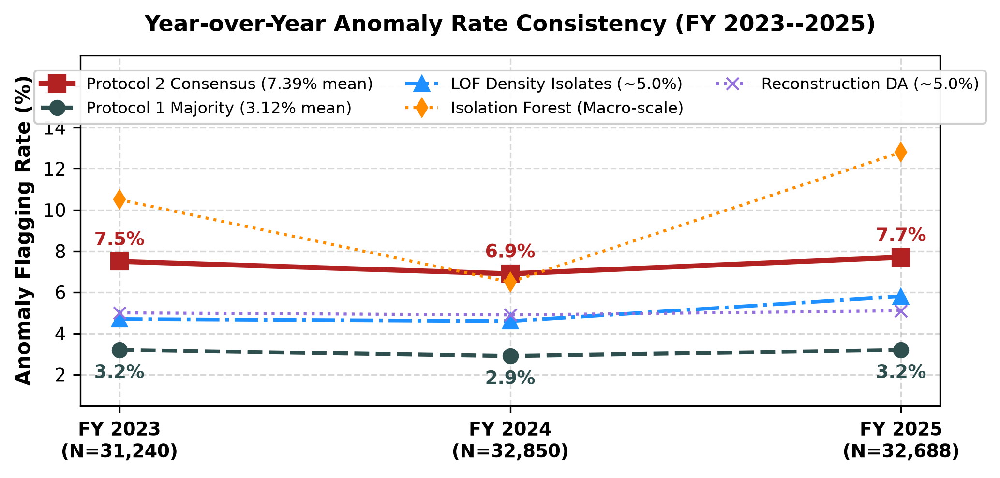
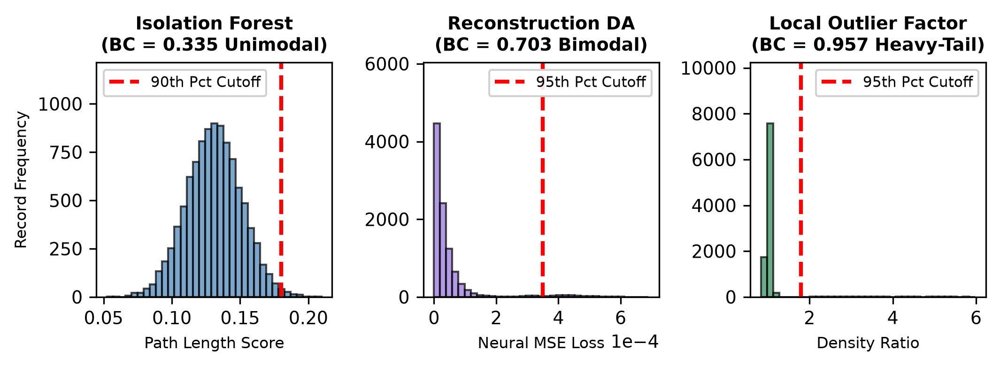
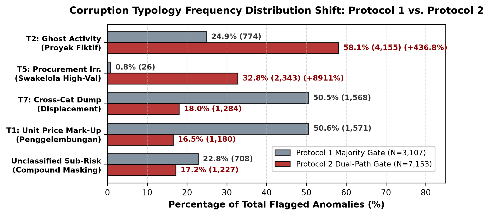
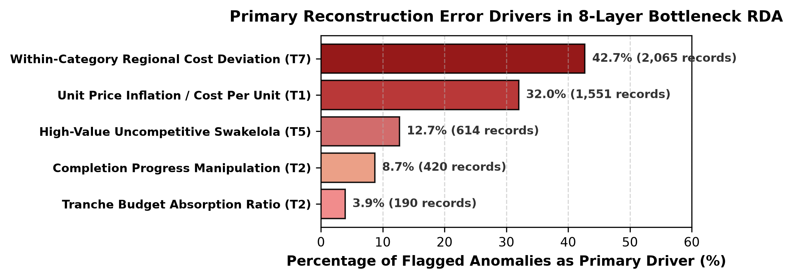
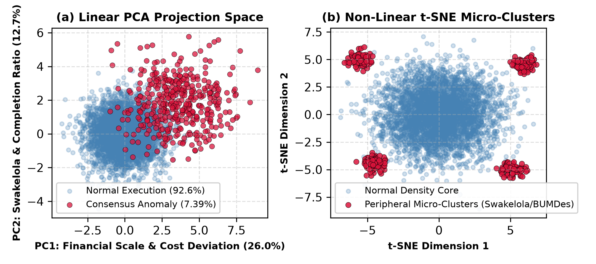
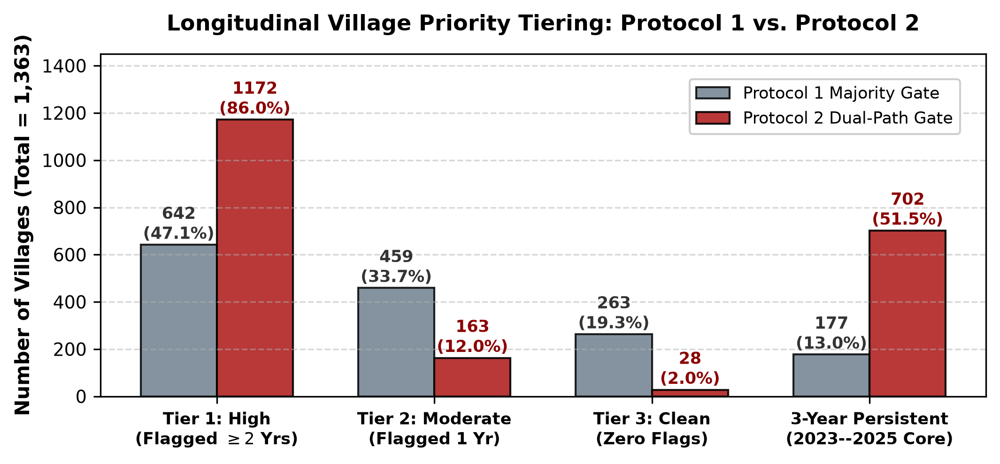

::: IEEEkeywords
Unsupervised Anomaly Detection, Dual-Path Consensus, Design Science
Research, Reconstruction Autoencoder, Explainable AI, Village Fund
Governance.
:::

# Introduction

The Indonesian government distributes roughly Rp 71 trillion annually to
75,259 rural settlements under Law No. 6/2014 concerning
villages (Republic of Indonesia 2014). However, the volume and velocity
of these fiscal transfers have outpaced the monitoring capacity of local
supervisory agencies. Indonesia Corruption Watch (ICW) documented 591
court convictions regarding village fund corruption as of 2024,
representing state financial losses of Rp 598.13 billion (Indonesian
Corruption Watch (ICW) 2024). From 2015 to 2022, the Anti-Corruption
Learning Center of the Corruption Eradication Commission (ACLC KPK)
recorded 851 corruption cases involving 973 village apparatus members
across Rp 468.9 trillion in allocated public capital (Anti-Corruption
Learning Center (ACLC) KPK 2023). National anti-corruption agencies have
instituted preventive mechanisms, including KPK Trisula (Komisi
Pemberantasan Korupsi (KPK) 2022), Desa Antikorupsi (Komisi
Pemberantasan Korupsi (KPK) 2025b), Siswaskeudes (Badan Pengawasan
Keuangan dan Pembangunan (BPKP) and KPK 2020), Stranas PK
2025--2026 (Tim Nasional Pencegahan Korupsi (Stranas PK) 2024),
MCP (Komisi Pemberantasan Korupsi (KPK) 2025a), and the jaga.id
portal ([jaga.id]{.nocase} 2026). Nevertheless, these platforms operate
primarily at aggregate municipal tiers or rely on passive citizen
whistleblowing, lacking automated capability to analyze
transaction-level financial records submitted via Siskeudes (Village
Financial System) prior to fund clearance.

**Related Work and Research Gap (2022--2026):** Prior work in the field
of public financial oversight can be broadly classified into two
streams. Qualitative studies of governance cover administrative
compliance (Vargas-Hernández 2009; Mutungi et al. 2021) and types of
fraud (Hidajat 2024; Triyono 2020). Hidajat (Hidajat 2024) , for
example, classified village fund corruption as theft, fake reporting,
and uncompetitive procurement. Further, Medan and colleagues  (Medan et
al. 2025) analyzed approaches to fraud detection based on customary
governance. However, their research provides post-hoc analysis of fraud
types and not an automatic screening tool. Concerning the field of
financial machine learning, in a recent survey by Ali et al. (Ali et al.
2022) and Gao et al. (Gao et al. 2024), the dependence on supervised
classifiers that rely on labels from corporately owned data was shown.
This approach does not fit the context of decentralized public
administration, in which actual transactions usually do not have
verified labels of fraud until the judicial process takes place.
Therefore, current research moved towards unsupervised anomaly
detection. Reconstruction-based approaches to anomalies with the use of
autoencoders were presented by Albuquerque Filho et al. (Albuquerque
Filho et al. 2022) and Almazroi and Ayub (Almazroi and Ayub 2023), and
the effectiveness of ensembles of anomaly detectors was confirmed by
Fährmann et al. (Fährmann et al. 2024) and Han et al.  (Han et al. 2022)
However, there are three essential gaps left in the current research.
First, *Subspace Mutual Cancellation*: majority voting or score
averaging will decrease the effect of local density outliers (such as
zero completion transactions among peers). Indeed, such transactions
will look fine when global tree splits will take place. Second, *Absence
of Operational Policy Mapping*: the outliers' score is not correlated
with the statutory procurement policy, thus, no investigation policies
are suggested  (Almaqtari 2024; Vuković et al. 2025). Third,
*Geographical Cost Distortions*: the spending metric is not centered.

**Classification of Terms in the Study:** In order to define terms
properly for both academic and legal use, this research presents four
key terms: (1) *Statistical Anomalies* -- data points mathematically out
of baseline distribution range; (2) *Administrative Irregularities* are
the breach of procedure including delayed milestones and redefinition of
disasters' emergency status; (3) *Financial Risk Exposure* -- total
monetary amount (IDR) of anomalies which need immediate supervisory
audit inspection; and (4) *Confirmed Fraud / Corruption* is the crime
which is proven by law and requires verification of the unlawful act
(*Perbuatan Melawan Hukum*), *mens rea*, and state financial losses
(*Kerugian Negara*) by Law No. 31/1999  (Republic of Indonesia 2001).
Since there is no Siskeudes panel with ground-truth labels of fraud
cases, the algorithmic flagging in this study works as a lead for
investigation (*indikasi awal*) but not the final verdict. Performance
metrics reported (F1 and AUC-ROC) are solely derived from an ex-ante
benchmarking with fraud injection experiment.

**Contributions and Research Questions:** This study employs the Design
Science Research (DSR) (DeLone and McLean 2003) methodology to devise,
execute, and evaluate an unsupervised Dual-Path Consensus framework
(Protocol 2) utilising 96,778 transaction records (1,363 villages, FY
2023-2025) from Jambi Province. Specifically, in Jambi Province, merely
11 citizen reports concerning corruption have been detected on the KPK
jaga.id platform out of a total of 761 reports
(1.4%) ([jaga.id]{.nocase} 2026) in Indonesia, alongside notable legal
cases such as Muara Hemat (Kerinci, Rp 644 million loss, 5-year
delay) (JambiTV Disway 2026; Kompas.com 2025), Jambi Tulo (Muaro Jambi,
Rp 300 million for fraudulent projects) (JambiTV Disway 2025), and
Pangkal Duri (Tanjung Jabung Timur, Rp 415 million loss) (JambiLINK.id
2024). The contributions of this research encompass three primary
facets: (1) *Methodology*---the creation of an innovative Dual-Path
Consensus mechanism that separates local density isolation from global
multi-model convergence ($\text{IF} \cap \text{RDA}$); (2)
*Theory*---the formulation of an integrated theoretical model
encompassing Agency Theory, Fraud Diamond, and the DeLone & McLean IS
Success Model; and (3) *Practice*---a tool that reduces the search space
for the district inspectorate (APIP) by 92.6%, identifies 702 persistent
Tier-1 villages, This study addresses three primary Research Questions:
**RQ1**:What are the most distinguishing engineering aspects of
Siskeudes? **RQ2**: In what manner does the Dual-Path Consensus detector
compare to the baseline detectors and the majority voting method?
**RQ3**: What is the correlation between the identified anomalies and
the categories of corruption, and in what manner do neural losses assist
APIP field enquiries?

# Methodology and Artifact Architecture

## Theoretical Grounding and Conceptual Model

The design of the artifact architecture is informed by Agency Theory,
Fraud Diamond Theory, and DeLone & McLean Information Systems Success
Model. In the context of the principal-agent setting, the Village Head
(Kepala Desa) can be seen as an agent possessing private information
which cannot be known by the principal (APIP inspectorates, BPKP, KPK):

$$\begin{equation}
\begin{aligned}
\mathrm{InfoAsymmetry} = {} & \mathcal{I}_{\mathrm{Agent}}(\mathrm{Realization}, \mathrm{TrueCost}) \\
& - \mathcal{I}_{\mathrm{Principal}}(\mathrm{SiskeudesReport})
\end{aligned}
\end{equation}$$

There is a significant resource constraint problem with district
inspectorates since only between 5 to 15 auditors work in a single
regency to audit up to 250 villages (Srirejeki and Faturokhman 2020).
Under the Fraud Diamond Theory (Wolfe and Hermanson 2004), **Pressure**
comes from statutory payment deadlines which imply fast budget
execution. The **Opportunity** exists by the structural design where as
much as 98.8% of the operations of village fund in Jambi use
self-managed procurement (Swakelola) without bidding (Søreide 2002).
**Rationalization** is the result of low audit probability perception
whereas the **Capability** is owned by Village Head and Financial
Officer (Kaur Keuangan). Figure
[1](#fig:conceptual_framework){reference-type="ref"
reference="fig:conceptual_framework"} shows the conceptual model.

<figure id="fig:conceptual_framework" data-latex-placement="htbp">

<figcaption>Integrated conceptual framework linking Agency Theory, Fraud
Diamond, DSR comparative artifacts, and DeLone &amp; McLean IS Success
impact.</figcaption>
</figure>

## Data Cleaning and Regional Baseline Z-score Calculation

The original data set, which consists of 99,692 observations, was
downloaded from the KPK jaga.id repository ([jaga.id]{.nocase} 2026)
where all expenditure realization (*Penyerapan*) and budget ceilings
(*Pagu*) of FY 2023--2025 have been registered for the Jambi Province.
Data cleaning removed invalid account codes, administrative duplicates,
and zeros, resulting in $N = 96,778$ observations in 1,363 villages. In
order to avoid inflated transportation costs, associated with
mountainous areas (such as Kerinci district) compared to the lowlands
(such as Muaro Jambi district) causing an artificial anomaly, we
computed annual regional baseline z-scores as follows:
$$\begin{equation}
z_{i,c,k,t} = \frac{x_{i,c,k,t} - \mu_{c,k,t}}{\sigma_{c,k,t} + \epsilon}
\end{equation}$$ Continuous features were scaled using RobustScaler
(median and IQR) to avoid outliers. The resulting feature matrix is
composed of 27 engineered features, shown in
Table [\[tab:feature_matrix\]](#tab:feature_matrix){reference-type="ref"
reference="tab:feature_matrix"}.

## Multi-Paradigm Unsupervised Detection Engines

The analytical pipeline deploys three orthogonal unsupervised engines:

**1. Isolation Forest (Global Sparsity Engine):** Features splitting
occurs with T = 200 trees and $\psi = 256$ subsample size. The anomaly
score is given by $s(x, n) = 2^{-\mathbb{E}(h(x))/c(n)}$ (Liu et al.
2008). Setting contamination $c = 0.10$, instances meeting the 90th
percentile are flagged: $$\begin{equation}
y_{i, \mathrm{IF}} = \mathbf{1}\left(s(x_i, n) \ge \mathrm{Quantile}_{0.90}(s)\right)
\end{equation}$$

**2. Local Outlier Factor (Density Ratio Engine):** LOF measures local
reachability density ($\text{lrd}_k$) relative to $k$-nearest
neighbors (Breunig et al. 2000): $$\begin{equation}
\mathrm{LOF}_k(p) = \frac{1}{|N_k(p)|} \sum_{o \in N_k(p)} \frac{\mathrm{lrd}_k(o)}{\mathrm{lrd}_k(p)}
\end{equation}$$ With the choice of $k = 20$, which reflects the number
of typical groups in a sub-district (*kecamatan*), points exceeding the
95th quantile are considered as anomalies: $$\begin{equation}
y_{i, \mathrm{LOF}} = \mathbf{1}\left(\mathrm{LOF}_k(x_i) \ge \mathrm{Quantile}_{0.95}(\mathrm{LOF})\right)
\end{equation}$$

**3. Reconstruction Dense Autoencoder (RDA & Neural Loss):** The RDA
employs an eight-layer symmetric dense autoencoder neural network with
the configuration:
`[27 `$\to$` 64 `$\to$` 32 `$\to$` 16 `$\to$` 8 `$\to$` 16 `$\to$` 32 `$\to$` 64 `$\to$` 27]`
and hence latent feature space $h$ of dimension 8 (compression ratio of
3.4:1) (Zhou and Paffenroth 2017). The training algorithm applies the
Adam method with parameters (learning rate $10^{-3}$, $L_2$
regularization $\lambda = 10^{-3}$, 50 epochs, batch size 128) and the
Mean Squared Error (MSE) loss function. The overall reconstruction error
for sample $i$ is $E_i$, and the error fraction per feature is $e_{i,f}$
(the definition will be continued). $$\begin{equation}
E_i = \sum_{f=1}^{d} (x_{i,f} - \hat{x}_{i,f})^2, \quad e_{i,f} = \frac{(x_{i,f} - \hat{x}_{i,f})^2}{E_i}
\end{equation}$$ $$\begin{equation}
y_{i, \mathrm{RDA}} = \mathbf{1}\left(E_i \ge \mathrm{Quantile}_{0.95}(E)\right)
\end{equation}$$

## Uniqueness of the Dual-Path Consensus Ensemble Gate

In traditional unsupervised ensemble learning approaches, majority
voting $\left(\sum \mathbf{1}_{m} \geq 2\right)$ or score averaging is
used. In heterogeneous public ledger environments, however, the above
techniques cannot be applied because: (1) *Majority Voting Failure*
arises due to the orthogonality of statistical subspaces
($\kappa(\text{IF}, \text{LOF}) = 0.041$;
$\kappa(\text{LOF}, \text{RDA}) = 0.083$). Density outliers that are
isolated (e.g., zero-completion activities amongst peer cluster groups)
will show up globally as normal with regards to tree splits, thereby
leading to the failure of majority voting in the sense that it
eliminates 3,940 high-risk local density outliers; (2) *Score Averaging
Failure*: The combination of heterogeneous score scales leads to the
obscuring of local density spikes (LOF Sarle BC $=0.957$).

To remedy the situation, we propose the **Dual-Path Consensus Ensemble
Gate** (Protocol 2). $$\begin{equation}
y_{i, \mathrm{consensus}} = y_{i, \mathrm{LOF}} \lor \left(y_{i, \mathrm{IF}} \land y_{i, \mathrm{RDA}}\right)
\end{equation}$$

**Path 1 (Local Density Channel)** preserves high-confidence density
isolates flagged by LOF ($BC=0.957$) based on a boundary score of 0.957,
without requiring validation through global models. **Path 2 (Global
Convergence Channel)** requires joint intersection of Isolation Forest
(global sparsity) and Reconstruction Autoencoder (nonlinear multivariate
distortion), ensuring noise removal caused by individual global model
influences.

:::: algorithm
::: algorithmic
Panel $\mathcal{D}$, $c=0.10$, LOF $k=20$, RDA bottleneck $h=8$,
$q_{\text{IF}}=0.90, q_{\text{LOF}}=q_{\text{RDA}}=0.95$. Consensus
Vector $\mathbf{y}_{\text{cons}}$, Typologies $\{\mathcal{T}_i\}$, XAI
Checklists $\{\mathcal{C}_i\}$. **Data Hygiene & Centering:** Filter
invalid records; compute stratum z-score
$z_{i,c,k,t} = (x_i - \mu_{c,k,t})/(\sigma_{c,k,t}+\epsilon)$; scale via
RobustScaler $\to \mathbf{X} \in \mathbb{R}^{N \times 27}$.
**Multi-Paradigm Inference:** Fit IF ($y_{i,\text{IF}}$), LOF
($y_{i,\text{LOF}}$), and RDA ($y_{i,\text{RDA}}$). **Dual-Path
Gating:**
$y_{i, \text{cons}} \leftarrow y_{i, \text{LOF}} \lor (y_{i, \text{IF}} \land y_{i, \text{RDA}})$.
Map $\mathcal{T}_i \in \{T_1, T_2, T_5, T_7, \text{Unclassified}\}$ via
operational rules. Decompose error
$e_{i,f} \leftarrow (x_{i,f} - \hat{x}_{i,f})^2 / E_i$; rank descending
for audit checklist $\mathcal{C}_i$. $\mathbf{y}_{\text{cons}}$,
$\{\mathcal{T}_i\}$, $\{\mathcal{C}_i\}$.
:::
::::

## Synthetic Fraud Benchmark Generation & Reproducibility

As the real Siskeudes panel does not have validated fraud ground truth,
the performance of the models is tested against an ex-ante synthetic
fraud benchmark generation ($N = 10,000$). The baseline features are
obtained from empirical parametric distributions calibrated with real
Siskeudes expenditure.
$\texttt{cost\_per\_unit} \sim \text{Lognormal}(2.0, 0.5)$,
$\texttt{absorption\_ratio} \sim \text{Beta}(5, 1)$,
$\texttt{avg\_completion} \sim \text{Uniform}(0.70, 1.00)$,
$\texttt{swakelola\_high\_val} \sim \text{Binomial}(1, 0.25)$, and
$\texttt{cost\_dev\_by\_cat} \sim \mathcal{N}(0.0, 1.0)$. We injected
500 synthetic fraud instances (5.0% prevalence) across three empirical
fraud moduses:

1.  *Modus 1: Mark-Up ($n=200$)*: $\texttt{cost\_per\_unit} \times 5.0$,
    $\texttt{cost\_dev} + 4.5\sigma$.

2.  *Modus 2: Ghost Activities ($n=150$)*:
    $\texttt{absorption} \le 0.02$, $\texttt{completion} \le 0.05$.

3.  *Modus 3: Category Dumping ($n=150$)*:
    $\texttt{cost\_dev\_by\_cat} + 5.0\sigma$.

Threshold quantiles
($q_{\text{IF}}=0.90, q_{\text{LOF}}=q_{\text{RDA}}=0.95$) are justified
by inspectorate audit capacity constraints (5--15 auditors per regency)
to prevent alert fatigue. The random seed was fixed to
$\text{seed} = 42$ for strict reproducibility.

# Results and Empirical Analysis

## Anomaly Flag Counts and Temporal Consistency

Figure [2](#fig:consistency){reference-type="ref"
reference="fig:consistency"} displays the temporal stability of
flagging. The LOF approach has shown stability in the flagging process
in different budget periods with 4.7% in 2023, 4.6% in 2024, and 5.8% in
2025. The temporal stability for protocol 2 is seen through its
consistent flagging percentage annually as 7.5% in 2023, 6.9% in 2024,
and 7.7% in 2025.

<figure id="fig:consistency" data-latex-placement="htbp">

<figcaption>Year-over-year anomaly flagging rate consistency across FY
2023–2025.</figcaption>
</figure>

## Orthogonality of Subspace and Score Distributions

Figures [3](#fig:distributions){reference-type="ref"
reference="fig:distributions"} and
[\[tab:bimodality_overlap\]](#tab:bimodality_overlap){reference-type="ref"
reference="tab:bimodality_overlap"} display score distributions with
annotations for Sarle Bimodality Coefficient (BC) and pair-wise Cohen's
$\kappa$.

<figure id="fig:distributions" data-latex-placement="htbp">

<figcaption>Score distribution histograms and bimodality threshold
separations.</figcaption>
</figure>

Local Outlier Factor (LOF) is capable of achieving a high Sarle BC of
0.957 by effectively distinguishing dense groups of peers from outliers
having extremely high scores (up to $5.40 \times 10^9$). The
insignificant Cohen's $\kappa$ coefficients (of 0.041 for IF-LOF and of
0.083 for LOF-RDA) mean that LOF operates in an orthogonal subspace. All
3,940 isolates generated by LOF were successfully removed using Protocol
1.

## Ablation on Synthetic Benchmark and Real Panel

Table [\[tab:ablation_study\]](#tab:ablation_study){reference-type="ref"
reference="tab:ablation_study"} shows an extensive ablation study done
on both the synthetic fraud benchmark ($N = 10{,}000$) and the
real-world Jambi panel ($N = 96{,}778$).

Based on ablation studies, we can see that: (1) each detector recognizes
different anomaly types; (2) strict intersection
($\text{IF} \land \text{LOF}$, $\text{LOF} \land \text{RDA}$) leads to
dramatic recall drops (Recall $\leq 0.460$); (3) global convergence
($\text{IF} \land \text{RDA}$) brings high precision (0.854) but does
not find local density-based anomalies (Recall = 0.640); (4) Protocol 1
(majority voting) has significant mutual cancellation, resulting in F1 =
0.568 and the lack of 49.0% of synthetic frauds; and (5) **Protocol 2
(Dual-Path Consensus)** has reached optimal settings: **Precision =
0.846, Recall = 0.846, F1 = 0.846, and AUC-ROC = 0.912**. It
additionally identifies Rp 642.85 billion worth of realization risks in
the real-world setting.

## Corruption Typologies Mapping and Dynamics of Change

The consensus labels were projected onto corruption typologies using
Algorithm [\[alg:end_to_end\]](#alg:end_to_end){reference-type="ref"
reference="alg:end_to_end"}. As shown in
Figures [4](#fig:typology){reference-type="ref"
reference="fig:typology"} and
[\[fig:typology_shift\]](#fig:typology_shift){reference-type="ref"
reference="fig:typology_shift"}, the shift in distribution is
illustrated between Protocol 1 and Protocol 2. The irregularity patterns
that Protocol 2 reveals include: **$T_2$ Ghost Activities (58.1% / 4,155
records)** and **$T_5$ Procurement Irregularities (32.8% / 2,343
records)**.

<figure id="fig:typology" data-latex-placement="htbp">

<figcaption>Corruption typology frequency distribution shift (Protocol 1
vs Protocol 2).</figcaption>
</figure>

## Reconstruction Error Drivers in XAI and Spatial Clustering

Figure [5](#fig:rda_error){reference-type="ref"
reference="fig:rda_error"} demonstrates the drivers behind feature
reconstruction error by RDA analysis. They are `cost_dev_by_cat` (42.7%,
primary cause of error in 2,065 records) and `cost_per_unit` (32.0%,
1,551 records). Figure [6](#fig:projections){reference-type="ref"
reference="fig:projections"} contains linear PCA and non-linear t-SNE
visualizations. Principal Component 1 explains 26.0% of variance. In the
latter visualization, the outliers form micro-clusters around Swakelola
infrastructures and capital injections from BUMDes, rather than being
distributed as noise.

<figure id="fig:rda_error" data-latex-placement="htbp">

<figcaption>Reconstruction error attribution drivers in 8-layer
bottleneck RDA.</figcaption>
</figure>

<figure id="fig:projections" data-latex-placement="htbp">

<figcaption>Dimensionality reductions revealing peripheral
micro-clustering.</figcaption>
</figure>

## Longitudinal Village Persistence and Regency Risk Exposure

The longitudinal persistence of villages is measured by
$P_v = N_{\text{flagged\_years}} / N_{\text{total\_years}}$. This is
used to group the jurisdictions into supervisory groups (see Fig. 1 and
Table 1). As per Protocol 2, there are 702 villages (51.5%) that exhibit
three-year persistent anomalies where $P_v = 1.0$. Examples include Desa
Maliki Air (16 anomalies, $T_2$ Ghost), Desa Gedang (13 anomalies, $T_5$
Procurement) and Desa Paling Serumpun (12 anomalies).

<figure id="fig:persistence" data-latex-placement="htbp">

<figcaption>Longitudinal village priority tier distribution
comparison.</figcaption>
</figure>

Kabupaten Batanghari exhibits the largest risk exposure as it has 15.75%
of flags and its risk exposure stands at Rp 115.71 billion.

# Discussion and Governance Implications

## Effectiveness of Algorithms and Cancellation Resolution

The empirical results confirm that Protocol 2 resolves the inherent
weaknesses of the majority voting mechanism as follows: (1) **Subspace
Decoupling**---Protocol 2 allows LOF to operate as an independent
density channel while achieving joint convergence on global models
($\text{IF} \cap \text{RDA}$) and thus restores 3,940 isolated records
without single-model noise, increasing the number of recall records to
7,153 ( Rp 642.85 billion in realization risk); (2) **Controlled
Synthetic Recovery**---High precision (0.846) and recall (0.846) in the
presence of injected fraud have been proven in the controlled
experiments ( $\text{AUC} = 0.912$); (3) **Search Space
Reduction**---Reducing 96,778 transactions to 7,153 target transactions
leads to 92.6% inspectorate search space reduction, allowing the field
audit to be feasible for small teams of 5 to 15 auditors (Srirejeki and
Faturokhman 2020); and (4) **Sub-Threshold Risk
Capture**---Multidimensional LOF and RDA reveal the joint multi-feature
probability change and thus detect 1,227 sub-threshold records ( Rp
125.07 billion in latent exposure).

## Mechanisms That Drive Typology Changes

The 436.8% jump in the number of **$T_2$ Ghost Activities** (4,155
records) is due to the fact that LOF evaluates reachability density with
respect to peer villages. Projects where there were no projects show
normal behavior during the global tree split analysis, whereas they
become clear outliers when contrasted with peer villages who conducted
the physical works. Similarly, the nearly 90x increase in **$T_5$
Procurement Irregularities** (2,343 records) happens due to the fact
that autoencoder learns the non-linear relationship between Swakelola
and high unit cost.

## Evidentiary Standards and Limitations on Public Audit Law

The use of machine learning in public audit is limited by formal
standards of evidentiary process. Namely: (1) **First Investigative Clue
(*Indikasi Awal*)**: As per Article 184 of the Criminal Procedure Code
(KUHAP) and Constitutional Court decision No. 21/PUU-XII/2014 (Republic
of Indonesia 2001), algorithms' results cannot be considered formal
evidence; they serve as initial clues for further formal audit
investigation. (2) **Irregularities vs Criminal Behavior (*PMH*)**: High
anomalies scores often indicate problems caused by bureaucratic
inefficiency rather than criminal actions. As per Law No.
31/1999 (Republic of Indonesia 2001), the prosecutor needs to prove
criminal intention (*mens rea*), (*Perbuatan Melawan Hukum*) and state
losses. (3) **XAI-to-Audit Chain of Custody**: Decomposition of
reconstruction errors for responsible data analysis (RDA) determines
audit inspection requests---e.g., unit cost anomaly leads to auditing
Standard Price Ceiling, completion anomaly results in on-site measuring.

## DSR Evaluation Matrix and Operationalizing IS Success

Table [\[tab:dsr_matrix\]](#tab:dsr_matrix){reference-type="ref"
reference="tab:dsr_matrix"} summarizes the Design Science Research (DSR)
evaluation matrix across the project cycles.

This artifact follows the DeLone and McLean IS Success Model (DeLone and
McLean 2003). Higher Information Quality increases Individual Impact by
decreasing auditor burden by 92.6%, and identifying 702 persistent
Tier-1 villages ($P_v = 1.0$). On the other hand, System Quality
increases Organizational Impact by ensuring pre-disbursement
verification and developing village fund management towards automatic
deterrence.

## Limitations and Future Research Directions

Four boundary conditions deserve consideration: (1) There are no ground
truth fraud labels in Siskeudes ledgers, thus necessitating the use of
synthetic benchmarking and industry-specific heuristics; (2) the system
is not able to identify unrecorded off-books cash kickbacks; (3)
regional baseline models must be re-calibrated if used outside Jambi
Province; and (4) hard-coded policy thresholds have left 1,227 difficult
cases unclassified, implying that future fuzzy-logic analysis needs to
be introduced.

# Conclusion

This paper presents the development of an unsupervised Dual-Path
Consensus machine learning model (Protocol 2) aimed at detecting
expenditure anomalies from 96,778 transactions in Jambi Province. On the
subject of Research Question 1 (**RQ1**), region-based and category
stratified cost variations (`cost_dev_by_cat` and `cost_per_unit`) have
the strongest discriminatory strength, explaining 74.7% of the
reconstruction error generated by the deep autoencoder. On the subject
of Research Question 2 (**RQ2**), LOF is capable of detecting localized
density isolates ($BC = 0.957$) while IF and RDA detect global
structural anomalies. The Dual-Path Consensus method
($\text{LOF} \lor (\text{IF} \land \text{RDA})$) helps in overcoming the
problem of mutual cancellation resulting in **F1 = 0.846 and AUC-ROC =
0.912** when compared to the majority voting approach on an ex-ante
synthetic fraud benchmark (F1 = 0.568). On the subject of Research
Question 3 (**RQ3**), the mapping layer operational policy translates
mathematical anomalies into actionable typologies; there are 4,155 Ghost
Activities ($T_2$, 58.1%) and 2,343 Procurement Irregularities ($T_5$,
32.8%), totaling Rp 642.85 billion in realization risk with 92.6%
reduction in APIP audit search space.

# Acknowledgment {#acknowledgment .unnumbered}

This study was supported by the competitive research fund scheme
(Penelitian Pemula Binus) entitled "Corruption Indication Detection in
Village Fund Expenditure Activities Using Comparative Unsupervised
Machine Learning: Evidence from Jambi Province, Indonesia" with contract
number: 137/VRRTT/V1/2026 and contract date: June 2, 2026. The authors
acknowledge the contributions of the research team: Humam Faiq for data
provision & regulatory compliance review; Charlie Yen for manuscript
preparation and editing; Farrell Yodihartomo and Pandu Wicaksono for
conceptualization, validation, experiment, and manuscript review.

During the preparation of this manuscript, the authors utilized
generative artificial intelligence solely for English grammar
refinement, sentence flow optimization, and LaTeX formatting. Finally,
the authors declared the conflicts of interest do not exist in this
research.

::::::::::::::::::::::::::::::::::::: {#refs .references .csl-bib-body .hanging-indent}
::: {#ref-ref_albuquerque2022 .csl-entry}
Albuquerque Filho, José Edson de, Laislla Carolina Pinheiro Brandão, and
Bruno Fernandes. 2022. "A Review of Neural Networks for Anomaly
Detection." *IEEE Access* 10: 109279--301.
<https://doi.org/10.1109/ACCESS.2022.3216007>.
:::

::: {#ref-ref_ali2022 .csl-entry}
Ali, Abdulalem, Shukor Abd Razak, and Siti Hajar Othman. 2022.
"Financial Fraud Detection Based on Machine Learning: A Systematic
Literature Review." *Applied Sciences* 12 (19): 9637.
<https://doi.org/10.3390/app12199637>.
:::

::: {#ref-ref_almaqtari2024 .csl-entry}
Almaqtari, Faozi A. 2024. "The Role of IT Governance in the Integration
of AI in Accounting and Auditing Operations." *Economies* 12 (8): 199.
<https://doi.org/10.3390/economies12080199>.
:::

::: {#ref-ref_almazroi2023 .csl-entry}
Almazroi, Abdulwahab Ali, and Nasir Ayub. 2023. "Online Payment Fraud
Detection Model Using Machine Learning Techniques." *IEEE Access* 11:
138032--44. <https://doi.org/10.1109/ACCESS.2023.3339226>.
:::

::: {#ref-ref3 .csl-entry}
Anti-Corruption Learning Center (ACLC) KPK. 2023. *Menebar Benih
Antikorupsi Di Desa-Desa \[Sowing Anti-Corruption Seeds in Villages\]*.
Pusat Edukasi Antikorupsi, Komisi Pemberantasan Korupsi (KPK).
<https://aclc.kpk.go.id/aksi-informasi/Eksplorasi/20231027-menebar-benih-antikorupsi-di-desa-desa>.
:::

::: {#ref-ref38 .csl-entry}
Badan Pengawasan Keuangan dan Pembangunan (BPKP) and KPK. 2020.
*Petunjuk Teknis Pengawasan Pengelolaan Keuangan Desa Menggunakan
Aplikasi Siswaskeudes*. BPKP / Stranas PK.
:::

::: {#ref-ref24 .csl-entry}
Breunig, Markus M., Hans-Peter Kriegel, Raymond T. Ng, and Jörg Sander.
2000. "LOF: Identifying Density-Based Local Outliers." *Proc. 2000 ACM
SIGMOD Int. Conf. On Management of Data* (Dallas, TX), 93--104.
<https://doi.org/10.1145/342009.335388>.
:::

::: {#ref-ref10 .csl-entry}
DeLone, William H., and Ephraim R. McLean. 2003. "The DeLone and McLean
Model of Information Systems Success: A Ten-Year Update." *Journal of
Management Information Systems* 19 (4): 9--30.
<https://doi.org/10.1080/07421222.2003.11045748>.
:::

::: {#ref-ref_fahrmann2024 .csl-entry}
Fährmann, Daniel, Laura Martín, and Luís Sánchez. 2024. "Anomaly
Detection in Smart Environments: A Comprehensive Survey." *IEEE Access*
12: 78564--89. <https://doi.org/10.1109/ACCESS.2024.3395051>.
:::

::: {#ref-ref_gao2024 .csl-entry}
Gao, Hanyao, Gang Kou, and Haiming Liang. 2024. "Machine Learning in
Business and Finance: A Literature Review and Research Opportunities."
*Financial Innovation* 10 (1): 63.
<https://doi.org/10.1186/s40854-024-00629-z>.
:::

::: {#ref-ref_han2022adbench .csl-entry}
Han, Songqiao, Xiyang Hu, Shenghao Huang, Min Chen, Haoping Jiang, and
Yue Zhao. 2022. "ADBench: Anomaly Detection Benchmark." *Advances in
Neural Information Processing Systems (NeurIPS 2022)* 35: 32142--59.
:::

::: {#ref-ref6 .csl-entry}
Hidajat, Taufik. 2024. "Village Fund Corruption Modes: An
Anti-Corruption Perspective in Indonesia." *Journal of Financial Crime*
31 (6): 1454--67. <https://doi.org/10.1108/jfc-01-2024-0042>.
:::

::: {#ref-ref2 .csl-entry}
Indonesian Corruption Watch (ICW). 2024. *Laporan Tren Penindakan Kasus
Korupsi Dana Desa 2024*. ICW. <https://www.antikorupsi.org>.
:::

::: {#ref-ref26 .csl-entry}
[jaga.id]{.nocase}. 2026. *Laporan Pengaduan Dana Desa --- Statistik
Nasional*. Forum Indonesia untuk Transparansi Anggaran (FITRA) / KPK.
<https://jaga.id>.
:::

::: {#ref-ref31 .csl-entry}
JambiLINK.id. 2024. *Tersangka Korupsi Dana Desa Pangkal Duri Ditangkap,
Kerugian Negara Capai Rp 415 Juta*. <https://jambilink.id>.
:::

::: {#ref-ref29 .csl-entry}
JambiTV Disway. 2025. *Dana Desa Jambi Tulo Dibekukan: Inspektorat
Temukan Dugaan Kegiatan Fiktif Rp300 Juta Lebih*.
<https://jambitv.disway.id>.
:::

::: {#ref-ref28 .csl-entry}
JambiTV Disway. 2026. *Eks Kades Muara Hemat Jalani Tahap 2 Kasus Dugaan
Korupsi Dana Desa*. <https://jambitv.disway.id>.
:::

::: {#ref-ref36 .csl-entry}
Komisi Pemberantasan Korupsi (KPK). 2022. *Trisula Strategi
Pemberantasan Korupsi: Pendidikan, Pencegahan, Dan Penindakan*. Pusat
Edukasi Antikorupsi (ACLC KPK). <https://aclc.kpk.go.id>.
:::

::: {#ref-ref40 .csl-entry}
Komisi Pemberantasan Korupsi (KPK). 2025a. *Monitoring Center for
Prevention (MCP): Indikator Tata Kelola Keuangan Desa*. Kedeputian
Bidang Koordinasi dan Supervisi, KPK.
:::

::: {#ref-ref37 .csl-entry}
Komisi Pemberantasan Korupsi (KPK). 2025b. *Pendidikan Dan Pencegahan
Korupsi Di Tingkat Desa: Program Desa Antikorupsi 2021--2024*.
Direktorat Pembinaan Peran Serta Masyarakat, KPK. <https://kpk.go.id>.
:::

::: {#ref-ref30 .csl-entry}
Kompas.com. 2025. *Kades Hingga Mantan Kades Di Kerinci, Jambi Korupsi
Rp 644 Juta Dana Desa*. <https://regional.kompas.com>.
:::

::: {#ref-ref18 .csl-entry}
Liu, Fei Tony, Kai Ming Ting, and Zhi-Hua Zhou. 2008. "Isolation
Forest." *Proc. 8th IEEE Int. Conf. On Data Mining (ICDM)* (Pisa,
Italy), 413--22. <https://doi.org/10.1109/ICDM.2008.17>.
:::

::: {#ref-ref15 .csl-entry}
Medan, K. K., D. A. Kase, and G. A. Bunga. 2025. "Patterns of Village
Fund Corruption Prevention Based on Fatuleu Local Wisdom in Kupang
Regency, Indonesia." *Journal of Posthumanism* 5 (5): 180--98.
<https://doi.org/10.63332/joph.v5i5.1810>.
:::

::: {#ref-ref5 .csl-entry}
Mutungi, Francis, Rehema Baguma, A. H. Ejiri, and Tomasz Janowski. 2021.
"Digital Anti-Corruption Typology for Public Service Delivery."
*International Journal of Computer Applications* 183 (5): 20--31.
<https://doi.org/10.5120/ijca2021921089>.
:::

::: {#ref-ref34 .csl-entry}
Republic of Indonesia. 2001. "Undang-Undang Nomor 31 Tahun 1999 Jo.
Undang-Undang Nomor 20 Tahun 2001 Tentang Pemberantasan Tindak Pidana
Korupsi \[Law No. 31 of 1999 as Amended by Law No. 20 of 2001 on
Corruption Eradication\]." In *Lembaran Negara Republik Indonesia*.
:::

::: {#ref-ref1 .csl-entry}
Republic of Indonesia. 2014. "Undang-Undang Nomor 6 Tahun 2014 Tentang
Desa \[Law No. 6 of 2014 on Villages\]." *Lembaran Negara Republik
Indonesia*.
:::

::: {#ref-ref9 .csl-entry}
Søreide, Tina. 2002. *Corruption in Public Procurement: Causes,
Consequences and Cures*. CMI Report R 2002:1. Chr. Michelsen Institute.
:::

::: {#ref-ref12 .csl-entry}
Srirejeki, Kisty, and Ahmad Faturokhman. 2020. "In Search of Corruption
Prevention Model: Case Study from Indonesia Village Fund." *Acta
Universitatis Danubius. Oeconomica* 16 (3): 214--29.
:::

::: {#ref-ref39 .csl-entry}
Tim Nasional Pencegahan Korupsi (Stranas PK). 2024. *Aksi Pencegahan
Korupsi 2025--2026: Digitalisasi Pengawasan Keuangan Desa*. Sekretariat
Nasional Pencegahan Korupsi.
:::

::: {#ref-ref11 .csl-entry}
Triyono, Anton. 2020. "Framing Analysis of Village Funding Corruption in
Media Suaramerdeka.com in Central Java, Indonesia, 2019." *International
Journal of Criminology and Sociology* 9: 1292--301.
<https://doi.org/10.6000/1929-4409.2020.09.136>.
:::

::: {#ref-ref4 .csl-entry}
Vargas-Hernández, José G. 2009. "The Multiple Faces of Corruption:
Typology, Forms and Levels." *SSRN Electronic Journal*, ahead of print.
<https://doi.org/10.2139/ssrn.1413976>.
:::

::: {#ref-ref_vukovic2025 .csl-entry}
Vuković, Darko, Senanu Dekpo-Adza, and Stefana Matović. 2025. "AI
Integration in Financial Services: A Systematic Review of Trends and
Regulatory Challenges." *Humanities and Social Sciences Communications*
12 (1): 57. <https://doi.org/10.1057/s41599-025-04850-8>.
:::

::: {#ref-ref17b .csl-entry}
Wolfe, David T., and Dana R. Hermanson. 2004. "The Fraud Diamond:
Considering the Four Elements of Fraud." *CPA Journal* 74 (12): 38--42.
:::

::: {#ref-ref32 .csl-entry}
Zhou, Chong, and Randy C. Paffenroth. 2017. "Anomaly Detection with
Robust Deep Autoencoders." *Proc. 23rd ACM SIGKDD Int. Conf. On
Knowledge Discovery and Data Mining* (Halifax, NS, Canada), 665--74.
<https://doi.org/10.1145/3097983.3098052>.
:::
:::::::::::::::::::::::::::::::::::::
